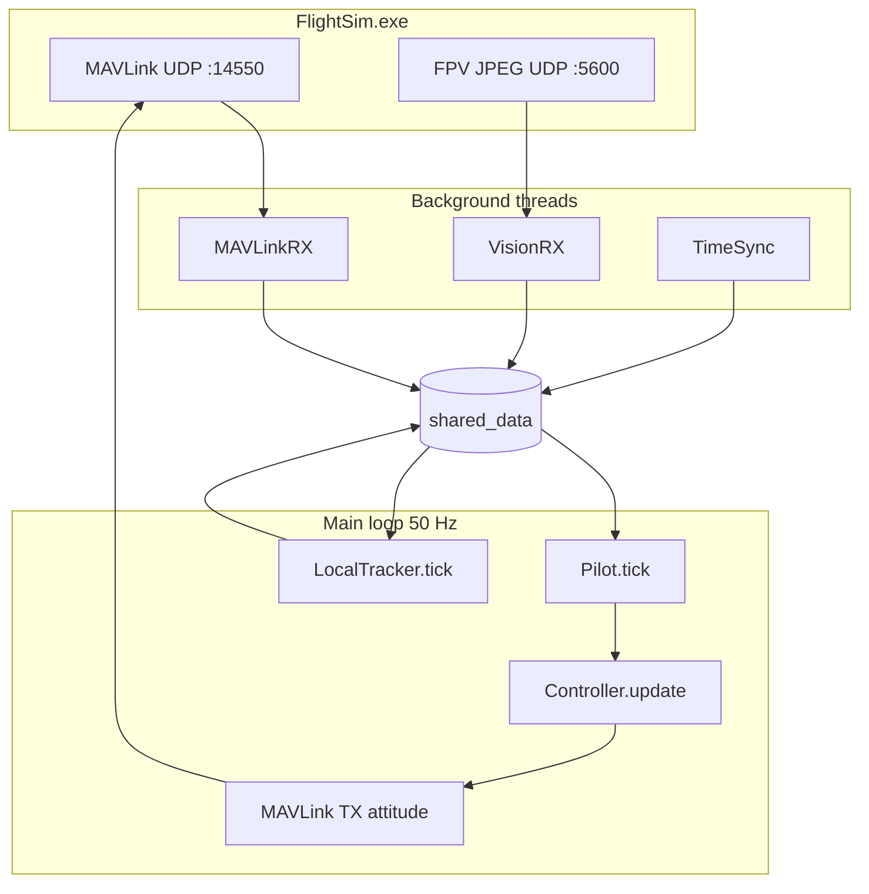
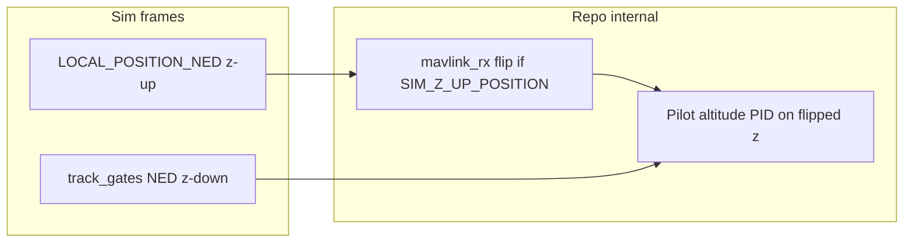
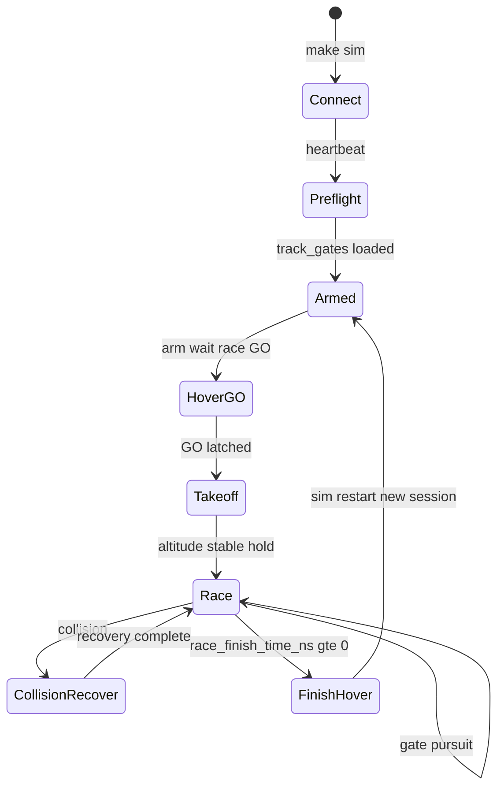
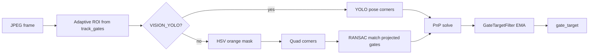
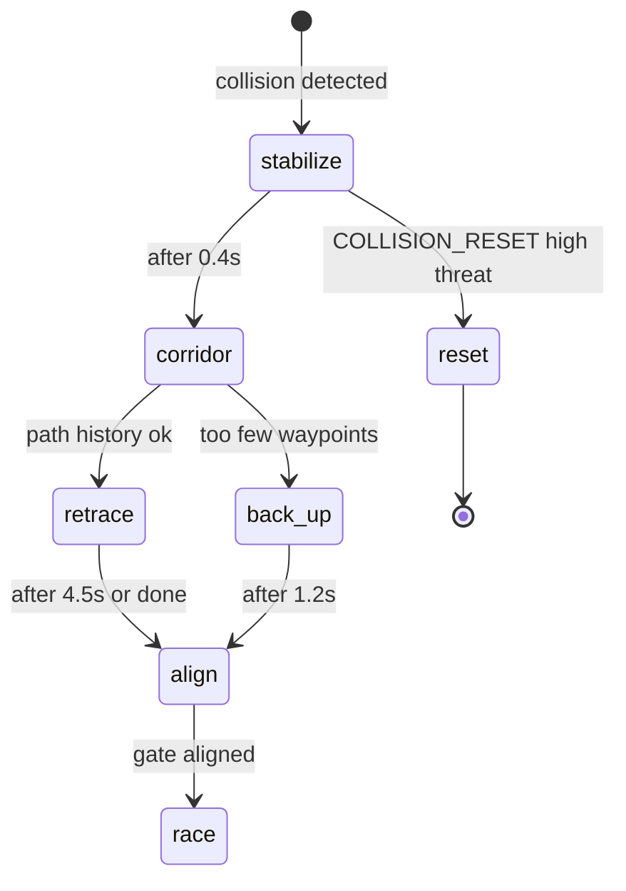

# Real Drone Sim — Flight Implementation Spec

Team-facing reference for planning and finalizing autonomous flight software.  
**Audience:** all repo contributors. **Entry point:** `make sim` (`uv run main.py`).

For live-run steps see [docs/qualifier-playbook.md](docs/qualifier-playbook.md).  
For competition context see [docs/Instructions.md](docs/Instructions.md).  
For research patterns see [docs/autonomous-drone-racing-research.md](docs/autonomous-drone-racing-research.md).

## Table of contents

1. [Mission](#1-mission)
2. [System overview](#2-system-overview)
3. [External interfaces](#3-external-interfaces)
4. [Shared state](#4-shared-state-shared_data)
5. [Flight phases](#5-flight-phases)
6. [Perception](#6-perception)
7. [State estimation](#7-state-estimation-localtracker)
8. [Navigation & planning](#8-navigation--planning)
9. [Control design](#9-control-design)
10. [Configuration](#10-configuration)
11. [Logging & validation](#11-logging--validation)
12. [Design principles & anti-patterns](#12-design-principles--anti-patterns)
13. [Current status & known gaps](#13-current-status--known-gaps)
14. [Definition of done (VQ Round 1)](#14-definition-of-done-vq-round-1)
15. [Planning decisions](#15-planning-decisions-for-team-discussion)
16. [Development workflow](#16-development-workflow)
17. [References](#17-references)

---

## 1. Mission

Build an **autonomous racing pilot** that connects to **FlightSim.exe** (AI Grand Prix official simulator) and completes qualifier laps with **zero human intervention**.

| Constraint | Detail |
|------------|--------|
| Sensing | Onboard FPV camera + MAVLink telemetry only — **no GPS** for navigation |
| Hardware parity | All teams fly identical Neros/DCL drones in competition; this repo targets the **simulator first** |
| VQ Round 1 | Simple, high-contrast, desaturated gate environment |
| VQ Round 2 | High-fidelity 3D-scanned tracks (YOLO pose path optional) |
| Control budget | ≤ 100 Hz MAVLink commands; pilot runs at **50 Hz** |

### Competition timeline

| Phase | Target |
|-------|--------|
| Virtual Qualifier Round 1 | Simple gate environment — current focus |
| Virtual Qualifier Round 2 | High-fidelity 3D-scanned tracks |
| Physical Qualifier | September 2026 (Southern California) |
| Finals | November 2026 (Ohio) |

Official competition site: [theaigrandprix.com](https://www.theaigrandprix.com/)

---

## 2. System overview



### Startup sequence

1. FlightSim.exe running, logged in, **active qualifier session** (not main menu).
2. `make sim` — binds UDP 14550 (MAVLink) and 5600 (vision).
3. Wait for heartbeat → load `track_gates` → arm → wait for race GO → control loop.

### Repo layout

| Path | Role |
|------|------|
| `main.py` | Entry: preflight, arm, race-GO latch, control loop |
| `simulator/setup.py` | Component wiring, port checks, heartbeat wait |
| `simulator/controller.py` | MAVLink command dispatch; owns `Pilot` |
| `simulator/pilot.py` | Race logic: takeoff, gate pursuit, collision recovery, telemetry |
| `simulator/flight_config.py` | **All tunable constants** — primary tuning surface |
| `simulator/flight_control.py` | IBVS/PN attitude, speed profiling, collision attitudes |
| `simulator/vision_processing.py` | Gate detection pipeline (HSV orange primary) |
| `simulator/tracking/local_tracker.py` | IMU propagation + NED blend + PnP correction |
| `simulator/racing_planner.py` | Racing line, pure pursuit, MPCC-inspired lookahead |
| `simulator/navigation.py` | Active gate, bearing, distances |
| `simulator/telemetry.py` | Per-tick flight CSV logger |
| `Makefile` | `sim`, `test`, diagnostics targets |
| `tests/` | Unit/integration tests (no FlightSim required) |

### Active vs legacy modules

| Module | Status | Notes |
|--------|--------|-------|
| `pilot.py`, `flight_control.py` | **Active** | VQ1 race path |
| `vision_processing.py`, `gate_detector.py`, `gate_pnp.py` | **Active** | Gate detection + PnP |
| `monorace_perception.py`, `gate_geometry.py`, `quad_gate.py` | **Active** | MonoRace ROI / RANSAC / corners |
| `racing_planner.py`, `navigation.py`, `gate_pass.py` | **Active** | Planning + pass detection |
| `blue_line_guidance.py`, `path_history.py` | **Active** | Corridor guidance + collision retrace |
| `state_machine.py`, `search.py`, `gate_estimator.py` | **Legacy** | Template/smoke only — not main race path |
| `config.py` dataclasses (`GateDetection`, `DroneState`) | **Legacy** | Used by legacy state machine / smoke tests |

**Rule:** new flight logic lives in `simulator/`; `main.py` stays minimal. No new CLI flags except existing `--collision-reset` / `COLLISION_RESET=1`.

---

## 3. External interfaces

### 3.1 MAVLink (UDP inbound `127.0.0.1:14550`)

Pilot acts as GCS: listens on `udpin`, sends GCS heartbeat, issues `SET_ATTITUDE_TARGET` in **body-rate mode** during race flight.

| Message / encapsulation | `shared_data` key | Use |
|-------------------------|-------------------|-----|
| `HEARTBEAT` | `armed` | Arm state |
| `HIGHRES_IMU` | `highres_imu` | Tracker propagation (120 Hz requested) |
| `ATTITUDE` | `attitude` | Yaw fallback |
| `LOCAL_POSITION_NED` | `local_position_ned` | Altitude PID source; NED blend |
| `ODOMETRY` | `odometry` | Pose fallback when tracker unhealthy |
| `ENCAPSULATED_DATA` type 1 | `race_status` | GO timing, active gate, finish, lap time |
| `ENCAPSULATED_DATA` type 2 + chunks | `track_gates` | Full gate map (NED positions + quaternions) |
| `COLLISION` | `collision` | Recovery trigger (`id` 1001=gate, 1002=environment) |
| `TIMESYNC` | `timesync` | Clock sync |

#### `race_status` fields

| Field | Meaning |
|-------|---------|
| `sim_boot_time_ms` | Sim uptime; resets on sim restart |
| `race_start_boot_time_ms` | Scheduled GO (first run) or countdown start (restart); `< 0` = not started |
| `race_finish_time_ns` | `≥ 0` when lap complete |
| `active_gate_index` | Sim's current target gate index |
| `last_gate_race_time` | Seconds when last gate passed (official lap timing) |

#### `track_gates[]` entry

```text
gate_id, position_ned (x,y,z), orientation_ned (w,x,y,z), width, height
```

#### Gate geometry (AGP spec §3.7)

| Dimension | Value |
|-----------|-------|
| Outer width | 2.7 m (`GATE_OUTER_MM`) |
| Inner opening | 1.5 m (`GATE_INNER_MM`) — used for pass detection + PnP |
| Depth | 260 mm (`GATE_DEPTH_MM`) |

#### `track_gates` usage policy

The sim delivers the full gate map via MAVLink encapsulated packets (not GPS). This repo uses `track_gates` for:

- Active gate selection (`race_status.active_gate_index`)
- Map bearing + MPCC racing line
- Vision adaptive ROI / projected corner matching
- Altitude target per gate

**Vision is still required** for gate centering, approach speed scaling, and PnP drift correction. Between gates ("perceptual desert"), flight leans on IMU tracker + map bearing until the next gate is visible.

> Official AGP rules on gate-map usage should be confirmed at [theaigrandprix.com/previousupdates](https://www.theaigrandprix.com/previousupdates/).

### 3.2 FPV vision (UDP inbound `0.0.0.0:5600`)

Chunked JPEG frames. Header: `frame_id, chunk_id, total_chunks, jpeg_size, payload_size, sim_time_ns`.

Decoded frames → `gate_target` (filtered) + `blue_guidance` + optional frame capture to `logs/frames/`.

### 3.3 Camera model (AGP / VADR-TS-002 §3.8)

| Parameter | Value |
|-----------|-------|
| Resolution | 640 × 360 |
| fx, fy | 320 |
| cx, cy | 320, 180 |
| Tilt | 20° up |
| FOV (vertical) | ~45° |

### 3.4 Control modes (internal)

`Controller` supports `motor`, `attitude`, `position`, `attitude_pose`, `position_pose`. **Race flight uses `attitude` (body rates + thrust)** — altitude held via thrust PID, not NED `vz` commands (caused climb-to-ceiling in FlightSim).

Sim reset: `MAVLINK_CMD_SIM_RESET = 31000` (optional after high-threat collision).

### 3.5 Conventions & pitfalls



| Convention | Detail |
|------------|--------|
| **NED z-down** | `track_gates`, racing path, gate pass geometry use standard NED (`z ≈ -5` ≈ 5 m altitude) |
| **Sim position z-up** | FlightSim `LOCAL_POSITION_NED` / `ODOMETRY` report z-up; `mavlink_rx` negates z and vz when `SIM_Z_UP_POSITION=1` (default) |
| **Pitch sign** | Negative `pitch_rate` = nose-down / forward in FlightSim body-rate mode (`CRUISE_FORWARD_PITCH_RATE = -0.065`) |
| **Control tick order** | Each 50 Hz cycle: `pilot.tick()` **then** `tracker.tick()` then MAVLink TX — pilot reads **previous tick's** `tracking_snapshot` |
| **Vision latency** | `VisionRX` runs async; `gate_target` may be up to one frame older than the control tick |

Misunderstanding z sign or tick order is a common source of altitude bugs and "one frame late" tuning confusion.

---

## 4. Shared state (`shared_data`)

Central dict populated by RX threads, consumed by pilot + tracker.

| Key | Producer | Consumer |
|-----|----------|----------|
| `track_gates` | MAVLinkRX | Pilot, navigation, vision ROI |
| `race_status` | MAVLinkRX | Pilot, preflight |
| `gate_target` | VisionRX | Pilot, tracker PnP fusion |
| `blue_guidance` | VisionRX | Pilot (corridor / collision recovery) |
| `camera` | VisionRX | Vision age, freshness |
| `tracking_snapshot` | LocalTracker | Pilot pose, health |
| `tracking_health` | LocalTracker | Diagnostics |
| `collision` | MAVLinkRX | Collision recovery |
| `_local_tracker` | setup | Controller tick |
| `_telemetry` | Pilot | Shutdown flush |

### `gate_target` schema

Produced by `detect_gate_target()` in `vision_processing.py`, smoothed by `GateTargetFilter`.

| Field | Type | Meaning |
|-------|------|---------|
| `detected` | bool | Gate visible this frame |
| `nx`, `ny` | float | Normalized offset from image center ∈ [-1, 1] |
| `r_frac` | float | Apparent gate size (fraction of min image dimension) |
| `corners` | `[(x,y), …]` or null | Image-space quad corners (4 points) |
| `pnp` | dict or null | PnP solve result (see below) |
| `source` | str | `yolo`, `hsv`, or mono projected-match path |

`pnp` sub-fields when present:

| Field | Meaning |
|-------|---------|
| `range_m` | Distance to gate plane |
| `lateral_m` | Lateral offset in gate frame |
| `fusion_mode` | MonoRace blend mode (`full`, `partial`, `reject`, etc.) |
| `num_corners` | Corners used in solve |
| `num_gates_visible` | Gates in multi-gate PnP |

### `blue_guidance` schema

| Field | Meaning |
|-------|---------|
| `detected` | Blue corridor lines found |
| `nx` | Lateral centering offset (normalized) |
| `confidence` | Detection confidence ∈ [0, 1] |

---

## 5. Flight phases



### 5.1 Race GO timing

| Scenario | GO instant |
|----------|------------|
| First run | `race_start_boot_time_ms` (scheduled) |
| After sim restart | `race_start_boot_time_ms + RACE_COUNTDOWN_MS` (default 3000 ms) |

Env overrides: `RACE_COUNTDOWN_MS`, `RESTART_ARM_BOOT_THRESHOLD_MS`. Calibrate with `make race-timing-probe`.

### 5.2 Takeoff

- Climb to **active gate altitude** (`gate.position_ned.z`).
- **No forward pitch** until within `TAKEOFF_ALT_TOLERANCE_M` (0.35 m), `vz` calm, and `TAKEOFF_STABLE_HOLD_S` (0.5 s) elapsed.
- Telemetry phase: `takeoff`.

### 5.3 Race flight

Per tick (`Pilot._fly_race` → `_fly_forward_attitude`):

1. **Pose** from healthy `LocalTracker` snapshot, else odometry.
2. **Bearing** — map/lookahead bearing when misaligned or no vision; MPCC lookahead when aligned + gate visible.
3. **Speed** — `perception_aware_speed()` capped by gate approach distances, inter-gate vision loss, post-gate slowdown.
4. **Attitude** — `direct_gate_attitude()` (IBVS + map yaw) or `blue_corridor_attitude()` when blue lines dominate.
5. **Align-before-pitch** — no forward pitch until bearing within ~40° (`ALIGN_PITCH_THRESHOLD_RAD`).
6. **Altitude** — thrust PID on NED z vs gate altitude; vz clamped (`ALTITUDE_VZ_CLAMP`).
7. **Gate pass** — local plane-crossing detection (`gate_pass.py`) vs sim `active_gate_index`.

### 5.4 Finish

`race_finish_time_ns >= 0` → hover, log `[RACE] gates_passed=… lap_time=…`.

### 5.5 Session restart

Sim reboot detected via `sim_boot_time_ms` drop → reset tracker, racing path, collision state, re-arm, wait for new GO.

---

## 6. Perception

### 6.1 Detection pipeline



**Priority:** YOLO (if enabled) → HSV centroid + corners → multi-gate projected match (MonoRace).

Pipeline modules: `vision_processing.py`, `gate_detector.py`, `monorace_perception.py`, `gate_pnp.py`.

### 6.2 Primary: orange gate (VQ1)

1. HSV orange mask (`#F3390F` family) — desaturation-aware thresholds.
2. Contour → quad corners → temporal `GateTargetFilter` (EMA + jump reject).
3. **MonoRace** path: adaptive ROI from projected `track_gates`, RANSAC corner match, multi-gate PnP.
4. Output `gate_target` (see [schema](#gate_target-schema)).

Normalized coords: `nx`, `ny` ∈ [-1,1] from image center; `r_frac` ≈ apparent gate size.

### 6.3 PnP fusion

`solve_gate_pnp` / `solve_multi_gate_pnp` → range + pose residual.  
Blend into tracker via `gate_fusion.py` with distance/corner-aware gain (`PNP_BLEND_MIN/MAX`, MonoRace modes).  
Gating: range 2–5 m, min corners, oblique reject, IMU saturation reduces blend.

### 6.4 Blue corridor lines

`blue_line_guidance.py` — HSV blue band detection for VQ1 track highlights.  
Used for: corridor centering during flight, **collision recovery** (corridor phase before retrace/align).

### 6.5 Round 2 (optional)

`VISION_YOLO=1` enables YOLOv8-Pose (`gate_pose_detector.py`, `models/gate_pose.pt`). Requires `uv sync --group vision`.

### 6.6 Vision freshness tiers

| Age | Behavior |
|-----|----------|
| ≤ `VISION_MAX_AGE_S` (0.45 s) | Fresh — full IBVS yaw blend |
| ≤ `VISION_STALE_AGE_S` (1.2 s) | Stale — reduced pitch/yaw |
| > stale | Lost — map bearing only, slower |

---

## 7. State estimation (`LocalTracker`)

```
HIGHRES_IMU → propagate position/velocity (body accel, gravity removed)
            → blend LOCAL_POSITION_NED (LOCAL_NED_BLEND)
            → blend ATTITUDE from sim
            → vision PnP correction when gate_target fresh
            → TrackingSnapshot → shared_data
```

| Concept | Detail |
|---------|--------|
| Origin | Reset at arm; relative NED from takeoff point |
| Health | Requires `MIN_IMU_SAMPLES_FOR_HEALTHY` IMU samples, no huge IMU gaps |
| IMU saturation | `imu_saturation.py` — damp accel when thrust-induced saturation suspected |
| Logging | `logs/tracking_state_*.csv` at `TRACKING_LOG_HZ` (10 Hz) |

**Known issue (VQ1):** IMU-only z drifts without NED blend; altitude PID uses sim NED z when available. See [docs/vq1-validation-report.md](docs/vq1-validation-report.md).

---

## 8. Navigation & planning

| Module | Function |
|--------|----------|
| `navigation.py` | `active_gate`, `bearing_error_from_pose`, `gate_distance` |
| `racing_planner.py` | `precompute_racing_path` — TOGT-lite corner-cut through 1.5 m opening |
| `racing_planner.py` | `mpcc_lookahead_target` — curvature-aware lookahead, shortens when vision lost |
| `gate_pass.py` | Host-side pass detect: cross gate plane forward inside inner square |

**Principle:** map/lookahead bearing drives yaw when misaligned; vision `nx` only fine-tunes when bearing agrees (prevents 180° spins).

---

## 9. Control design

### 9.1 Tier 1 — Gate-centric IBVS (`flight_control.py`)

- `direct_gate_attitude()` — yaw from bearing + gated vision nx; pitch scaled by align + perception confidence.
- `perception_aware_speed()` — slow on large bearing error, small/far gate, stale vision.
- `AttitudeCommandSmoother` — EMA + slew limits on rates/thrust.

### 9.2 Tier 2 — Racing line

- Precomputed crossing points per gate.
- MPCC-inspired lookahead adjusts bearing when aligned and gate visible.
- Speed caps: `GATE_APPROACH_*`, `INTER_GATE_VISION_*`, `POST_GATE_*`, overspeed brake.

### 9.3 Altitude

- **Thrust PID** on z error vs gate altitude (not velocity setpoints).
- `Z_CEILING_NED = -12` soft ceiling; pitch thrust compensation.

### 9.4 Collision recovery



| Phase | Timeout | Behavior |
|-------|---------|----------|
| `stabilize` | `COLLISION_STABILIZE_S` (0.4 s) | Hover, cut thrust |
| `corridor` | `COLLISION_CORRIDOR_MAX_S` (5.5 s) | Blue line centering |
| `retrace` | `COLLISION_RETRACE_MAX_S` (4.5 s) | Follow `path_history` waypoints back |
| `back_up` | `COLLISION_BACKUP_S` (1.2 s) | Reverse pitch if retrace unavailable |
| `align` | `COLLISION_ALIGN_MAX_S` (3.0 s) | Re-center on gate before resuming |
| `reset` | immediate | `reset_sim()` when `COLLISION_RESET=1` + high threat |

Path history: `path_history.py` records pose waypoints for retrace.

---

## 10. Configuration

**Single tuning file:** `simulator/flight_config.py`

| Category | Key constants (examples) |
|----------|-------------------------|
| Control rate | `CONTROL_HZ = 50` |
| Align / pitch | `ALIGN_PITCH_THRESHOLD_RAD`, `CRUISE_FORWARD_PITCH_RATE` |
| Speed | `V_MAX_BODY`, `V_TURN_SLOWDOWN`, `GATE_APPROACH_*` |
| Vision | `VISION_MAX_AGE_S`, `VISION_FILTER_ALPHA` |
| Altitude PID | `KP_Z`, `KI_Z`, `KD_Z`, `ALTITUDE_VZ_CLAMP` |
| Tracking | `LOCAL_NED_BLEND`, `ATTITUDE_BLEND` |
| PnP | `PNP_BLEND_*`, `MONORACE_*` |
| Collision | `COLLISION_STABILIZE_S`, `COLLISION_RETRACE_*` |

### 10.1 Tuning workflow

1. Edit `simulator/flight_config.py`
2. `make test`
3. `make sim` (FlightSim session active)
4. `make validate-flight-log` + `make validate-log`
5. Optional: `make compare-flight-logs LOG_A=… LOG_B=…` between tuning runs
6. Optional PnP quality: `uv run python -m scripts.validate_reprojection tracking.csv gates.json`

### Environment variables

| Variable | Default | Effect |
|----------|---------|--------|
| `SIM_Z_UP_POSITION` | on | Negate sim `LOCAL_POSITION_NED` / `ODOMETRY` z,vz to NED z-down |
| `AUTO_RESET_ON_COLLISION` | off | Sim reset on high-threat hit |
| `RACE_COUNTDOWN_MS` | 3000 | Restart countdown length |
| `RESTART_ARM_BOOT_THRESHOLD_MS` | 10000 | Detect restart vs first run |
| `VISION_YOLO` | off | YOLO pose detector |
| `YOLO_GATE_MODEL` | `models/gate_pose.pt` | Model path |
| `FRAME_CAPTURE` | on | Save annotated frames |
| `FRAME_CAPTURE_HZ` | 2 | Frame log rate |

---

## 11. Logging & validation

### 11.1 Flight telemetry CSV

`logs/flight_telemetry_<timestamp>.csv` — one row per control tick (50 Hz during race).

| Column | Meaning |
|--------|---------|
| `t_wall` | Wall-clock timestamp |
| `sim_time_ns` | Sim time from pose |
| `phase` | `takeoff`, `race`, `search`, collision phases |
| `gate_index`, `gate_id`, `gate_x/y/z` | Active gate |
| `dist_gate_xy`, `dz_gate` | Range to gate |
| `pose_x/y/z`, `yaw_deg`, `vx/vy/vz`, `speed` | Pose + velocity |
| `bearing_err_deg` | Heading error to target |
| `vision_detected`, `vision_source`, `nx`, `ny`, `r_frac`, `vision_age_s` | Vision state |
| `pnp_range_m`, `pnp_corners`, `pnp_gates`, `pnp_mode` | PnP metadata |
| `blue_active` | Blue corridor steering active |
| `target_speed`, `speed_scale` | Speed profiling |
| `pitch_rate`, `yaw_rate`, `thrust` | Control outputs |
| `track_status`, `track_healthy` | Tracker health |
| `gate_pass_detected`, `local_passed_index`, `sim_gate_index` | Pass tracking |
| `takeoff_ready`, `along_gate_m` | Takeoff gating, signed distance through gate plane |

```bash
make validate-flight-log
make compare-flight-logs LOG_A=... LOG_B=...
```

**Flight log pass criteria** (`scripts/validate_flight_log.py`):

- Non-empty log with `race` phase
- No forward pitch (`pitch_rate < -0.01`) during `takeoff` phase
- Peak `bearing_err_deg` during race < 90°
- If sim advanced gates (`sim_gate_index > 0`), local pass should be detected

### 11.2 Tracking CSV

`logs/tracking_state_*.csv` — columns from `TrackingSnapshot.as_dict()`:

`sim_time_ns`, `x`, `y`, `z`, `vx`, `vy`, `vz`, `roll`, `pitch`, `yaw`, `status`, `healthy`, `imu_samples`

```bash
make validate-log
```

**Tracking log pass criteria** (`scripts/validate_tracking_log.py`):

- `altitude_stable` = YES when healthy rows have z range < 8 m **and** z std < 3 m

### 11.3 Frame capture

`logs/frames/session_*/raw/` and `annotated/` when `FRAME_CAPTURE=1`.

### 11.4 Diagnostics

| Command | Purpose |
|---------|---------|
| `make test` | Full pytest suite |
| `make pilot-smoke` | Synthetic pilot stack |
| `make vision-smoke` | Offline gate detection |
| `make vision-smoke-live` | Live UDP vision |
| `make tracking-smoke` | Tracker unit behavior |
| `make mavlink-probe` | MAVLink connectivity |
| `make preflight` | UDP 5600 availability |
| `make race-timing-probe` | GO timing calibration |
| `uv run python -m scripts.validate_reprojection` | PnP reprojection IoU (manual; not in Makefile) |

### 11.5 Console output glossary

| Log line | Meaning |
|----------|---------|
| `Preflight OK: track_gates loaded` | Gate map ready |
| `Race go! branch=…` | GO latched; branch aids timing debug |
| `Gate pass detected index=N` | Local plane-crossing detected |
| `Gate pass mismatch: sim=… local=…` | Local pass count disagrees with sim |
| `Race finished! last_gate_race_time=…` | Sim reports lap complete |
| `[RACE] status=COMPLETE/DNF` | Local pass summary vs gate count |
| `Telemetry log: logs/flight_telemetry_…` | Per-tick CSV path |

---

## 12. Design principles & anti-patterns

### Principles

Derived from VQ1 flight logs and competition research — see [docs/autonomous-drone-racing-research.md](docs/autonomous-drone-racing-research.md).

1. **Progress + reliability over raw speed** — slow/hold when bearing large or vision stale.
2. **Map bearing before vision yaw** — vision fine-tunes only when aligned and agreeing.
3. **Align before pitch** — no forward pitch until heading within ~40° of target.
4. **Altitude via thrust PID in attitude mode** — no NED vz velocity commands in race.
5. **Graceful degradation** — stale vision → map only; collision → structured recovery.
6. **Perceptual desert** — between gates, IMU + `track_gates` NED; vision corrects drift at gates.
7. **50 Hz control** — watch end-to-end latency; predict forward if pipeline lags.

### Anti-patterns (VQ1 lessons)

| Anti-pattern | Symptom | Fix / avoidance |
|--------------|---------|-----------------|
| NED `vz` velocity commands in race | Climb to ceiling | Use attitude + thrust PID only (`flight_control.py`, `pilot.py`) |
| Vision-only yaw steering | 180° spins | Map bearing first; gate vision `nx` when aligned (`direct_gate_attitude`) |
| IMU-only altitude / low NED blend | Hundreds of m z drift | Raise `LOCAL_NED_BLEND`; clamp vz in PID — see [vq1-validation-report.md](docs/vq1-validation-report.md) |
| Forward pitch before align | Wide misses, wall hits | `ALIGN_PITCH_THRESHOLD_RAD` gating |
| Ignoring sim z-up vs track z-down | Altitude PID inverted | Keep `SIM_Z_UP_POSITION=1` or verify flip in `mavlink_rx.py` |
| Extending legacy `state_machine.py` | Duplicate/conflicting logic | Use `pilot.py` race path only |

---

## 13. Current status & known gaps

### Working

- MAVLink connect, arm, race GO latch (first run + restart).
- HSV gate detection + PnP fusion path.
- Attitude-mode race flight with align-first pitch, altitude PID.
- Racing line + MPCC lookahead.
- Collision recovery state machine + optional sim reset.
- Flight + tracking telemetry, frame capture, broad test coverage.

### Open / in progress (VQ1 DoD)

| Item | Status |
|------|--------|
| Full lap without intervention | In progress |
| Stable altitude in tracking logs | **Failing** — z drift; mitigations in `flight_config` |
| Recorded lap time (`last_gate_race_time`) | Not yet baseline |
| Local gate pass count matches sim | Partial — mismatch logged |
| Sim restart → second lap | Designed; needs live validation |
| `make validate-log` altitude stable | Not passing on recent logs |

See [docs/vq1-validation-report.md](docs/vq1-validation-report.md) and [docs/qualifier-playbook.md](docs/qualifier-playbook.md) Definition of Done.

---

## 14. Definition of done (VQ Round 1)

- [ ] `make test` passes
- [ ] `make sim` — connect, arm, race GO on first run and after restart
- [ ] Full lap without manual intervention
- [ ] `Race finished!` with `last_gate_race_time`; `[RACE] status=COMPLETE`
- [ ] Collision recovery (hold or `COLLISION_RESET=1`)
- [ ] Clean hover on finish
- [ ] `make validate-flight-log` clean on latest telemetry
- [ ] `make validate-log` — altitude stable on latest tracking log

---

## 15. Planning decisions (for team discussion)

Questions to close before locking flight implementation:

1. **Pose source of truth** — tracker-only vs NED blend weights for VQ1; acceptable drift between gates?
2. **Gate pass authority** — trust sim `active_gate_index` vs local plane-crossing for progress / logging?
3. **Speed target** — current `V_MAX_BODY=3.8` vs reliability; lap-time vs pass-rate tradeoff?
4. **Vision in desert** — lean on blue lines between gates vs map bearing only?
5. **Collision policy** — retrace vs `COLLISION_RESET=1` for qualifier runs?
6. **VQ2 readiness** — when to enable YOLO pose vs improve HSV/PnP?
7. **Sim-to-real** — which abstractions (rate limits, latency model) to add before hardware?

---

## 16. Development workflow

```bash
make install          # uv sync
make test             # before every merge / live run
make check            # ruff lint + format
make sim              # live pilot
make sim COLLISION_RESET=1   # optional auto-reset
```

- Python via **uv** only (`uv run …`).
- Scripts in `Makefile`, not `pyproject.toml` entry points.
- Run deslop skill before commits (per `AGENTS.md`).

### 16.1 Test coverage map

| Test file | Subsystem covered |
|-----------|-------------------|
| `test_pilot.py` | Race GO, takeoff gating, collision recovery, gate pass |
| `test_flight_config.py` | Config resolvers, env overrides |
| `test_racing_algorithms.py` | IBVS (`direct_gate_attitude`), speed profiling, racing line |
| `test_vision_processing.py`, `test_vision_rx.py` | Gate detection pipeline, UDP framing |
| `test_gate_pnp.py`, `test_gate_fusion.py` | PnP solve + tracker fusion |
| `test_monorace_perception.py` | ROI, RANSAC, reprojection |
| `test_gate_pass.py` | Plane-crossing pass detection |
| `test_local_tracker.py`, `test_imu_propagator.py`, `test_imu_saturation.py` | State estimation |
| `test_navigation.py` | Bearing, active gate |
| `test_blue_line_guidance.py` | Corridor detection |
| `test_path_history.py` | Collision retrace breadcrumbs |
| `test_telemetry.py`, `test_validate_flight_log.py` | Flight CSV logging + validation |
| `test_preflight.py`, `test_mavlink_rx.py`, `test_setup.py` | Connect / preflight / MAVLink RX |
| `test_frame_capture.py` | Annotated frame save |

---

## 17. References

| Doc | Content |
|-----|---------|
| [docs/Instructions.md](docs/Instructions.md) | Competition overview, sim install, timeline |
| [docs/qualifier-playbook.md](docs/qualifier-playbook.md) | Live runbook, troubleshooting |
| [docs/autonomous-drone-racing-research.md](docs/autonomous-drone-racing-research.md) | Research → code mapping |
| [docs/vq1-validation-report.md](docs/vq1-validation-report.md) | Live log findings, tuning notes |
| [AGP site updates](https://www.theaigrandprix.com/previousupdates/) | Official technical spec (external) |
| [Winning ADR survey](https://github.com/aimarket/awesome-autonomous-drone-racing/blob/main/ai-research/winning-autonomous-drone-racing.md) | External orientation (verify sources) |

---

## Changelog

| Date | Change |
|------|--------|
| 2026-06-16 | Initial team spec |
| 2026-06-16 | Full improvement pass: conventions, schemas, diagrams, validation criteria, test map, glossary |

*Update this spec when interfaces, defaults, or DoD change. Add a one-line changelog entry per substantive edit.*
