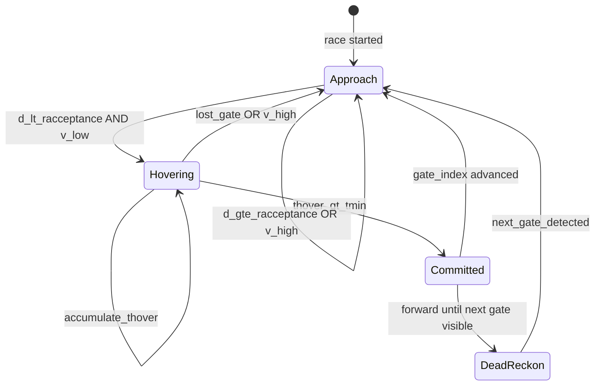

# Gate Transition Trigger Plan

Branch: `Sameer-Gate-transition-trigger`

## Decisions (resolved)

| Question | Answer |
|----------|--------|
| Pixel→metre scale | **Sim track data** — use per-gate `width`/`height` from `on_track_data()` |
| Hover cap | **`t_min` only** — no `t_max` force-commit |
| Velocity | **IMU integration** — `HIGHRES_IMU` accel, no optical flow |
| Post-commit nav | **Dead reckon** forward until next gate appears in vision |

---

## Context

Repo is MAVLink stub; gate pass is server-side (`active_gate_index` in [`simulator/mavlink_rx.py`](../simulator/mavlink_rx.py)). Client adds when to commit to next gate vs hover on current.



**Rules:**

```
hovering  = (d < r_acceptance) AND (speed < v_max)
commit    = hovering AND (thover > t_min)
post_commit = dead_reckon_forward until perception.gate_visible
```

---

## Phase 1 — Telemetry plumbing

Wire MAVLink into `shared_data` in [`simulator/mavlink_rx.py`](../simulator/mavlink_rx.py).

**`on_race_status()`** → `race.active_gate_index`, `race.last_gate_race_time`, `race.sim_boot_time_ms`; detect index change → `race.gate_passed_event = True`

**`on_track_data()`** → store gate list:

```python
track.gates[i] = {gate_id, width, height, position_ned, orientation_ned}
track.num_gates
```

Use `track.gates[active_gate_index].width` for pixel→metre scale in perception. If width is 0/nulled (competition config), log warning and skip commit (safe default).

**`on_highres_imu()`** → `imu.accel` (m/s²), `imu.gyro`, `imu.time_boot_us`

---

## Phase 2 — `simulator/gate_transition.py`

Pure state machine — no MAVLink/vision imports.

```python
@dataclass
class GateTransitionConfig:
    r_acceptance: float   # m
    t_min: float          # s — sole dwell threshold, no t_max
    v_max: float          # m/s

class GateTransitionTracker:
    def update(self, d, speed, now) -> GatePhase
    def should_commit(self) -> bool
    def on_gate_passed(self) -> None
```

**`thover` logic:**

- `d < r_acceptance` AND `speed < v_max` → accumulate dt
- else → reset `thover = 0`, phase = `Approach`
- `thover > t_min` → phase = `Committed`

No `t_max` branch.

**Outputs:** `gate.phase`, `gate.thover`, `gate.d`, `gate.should_commit`

Defaults: `r_acceptance` 0.5 m, `t_min` 0.5 s, `v_max` 1.0 m/s

---

## Phase 3 — `simulator/gate_perception.py`

Vision lateral offset `d` (metres).

1. [`simulator/vision_rx.py`](../simulator/vision_rx.py) stores latest frame in `shared_data`
2. Detect gate opening (VQ1: contour/color threshold)
3. Lateral pixel offset from frame center → `px_offset`
4. Scale using **track gate width**:

   ```
   d = (px_offset / gate_bbox_width_px) * track.gates[active_index].width
   ```

5. Outputs: `perception.gate_lateral_m`, `perception.gate_visible`, `perception.confidence`

Gate not visible → `d = inf`, no false commit.

---

## Phase 4 — `simulator/velocity_estimate.py`

**IMU integration only** (no optical flow).

New module; called each controller tick:

- Integrate body-frame accel from `HIGHRES_IMU` over dt
- Remove gravity component (assume level flight or use attitude if re-enabled later)
- Expose `state.speed_mps = |v|` (magnitude) for hover check
- Also expose `state.velocity_ned` for dead reckoning

Reset integration drift on gate pass event or when speed estimate diverges (simple clamp).

---

## Phase 5 — Dead reckoning post-commit

New logic in [`simulator/controller.py`](../simulator/controller.py) or `simulator/dead_reckon.py`:

After `gate.should_commit`:

- Command fixed forward velocity (body-forward NED)
- Accumulate distance from IMU-integrated velocity
- Stay in `DeadReckon` until `perception.gate_visible` for **next** gate
- On next gate visible → reset tracker, phase = `Approach`, center on new gate

No vision of next gate → keep dead reckoning at commanded speed (no timeout per `t_min`-only decision).

---

## Phase 6 — Controller integration

[`simulator/controller.py`](../simulator/controller.py) `update()` @ 250 Hz:

```
1. velocity_estimate.tick(imu, dt)
2. d = perception.gate_lateral_m (or inf)
3. tracker.update(d, state.speed_mps, now)
4. if race.gate_passed_event: tracker.on_gate_passed()
5. switch gate.phase:
     Approach    → lateral centering on current gate
     Hovering    → hold / reduce forward thrust
     Committed   → start dead reckon
     DeadReckon  → forward velocity until next gate visible
```

Init tracker + config in [`simulator/setup.py`](../simulator/setup.py). No CLI args in `main.py`.

---

## Phase 7 — Validation

`make sim` checklist:

1. Track data loads → gate widths available for scale
2. Approach → `hovering` when centered + IMU speed low
3. No commit before `t_min`
4. After `t_min` → `committed` → dead reckon forward
5. Next gate visible → back to `approach`
6. `active_gate_index` increment → tracker reset
7. Gate lost mid-hover → `thover` resets

Unit tests: `GateTransitionTracker` timing (no sim).

---

## File summary

| File | Action |
|------|--------|
| `simulator/gate_transition.py` | **New** — state machine (`t_min` only) |
| `simulator/gate_perception.py` | **New** — lateral `d`, track-width scale |
| `simulator/velocity_estimate.py` | **New** — IMU integration |
| `simulator/dead_reckon.py` | **New** — post-commit forward nav |
| `simulator/mavlink_rx.py` | Publish race, track, IMU |
| `simulator/vision_rx.py` | Frames + perception call |
| `simulator/controller.py` | Wire all modules |
| `simulator/setup.py` | Init shared state |

---

## Implementation checklist

- [x] Phase 1: Publish race, track gates (width/height), IMU to shared_data
- [x] Phase 2: Add gate_transition.py — t_min only, no t_max
- [x] Phase 3: Add gate_perception.py — lateral d scaled by track gate width
- [x] Phase 4: Add velocity_estimate.py — IMU accel integration
- [x] Phase 5: Add dead_reckon.py — forward until next gate visible
- [x] Phase 6: Wire tracker + dead reckon into controller.update()
- [x] Phase 7: Unit test tracker timing (14 tests, `make test`) — VQ1 sim validation pending live server
