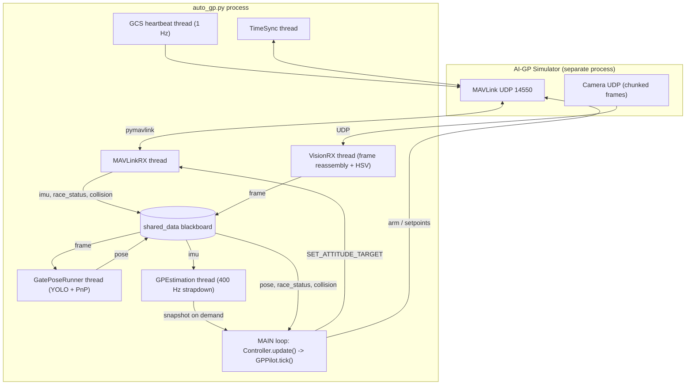
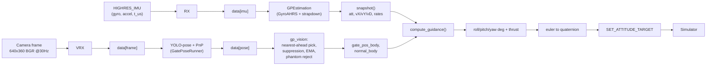
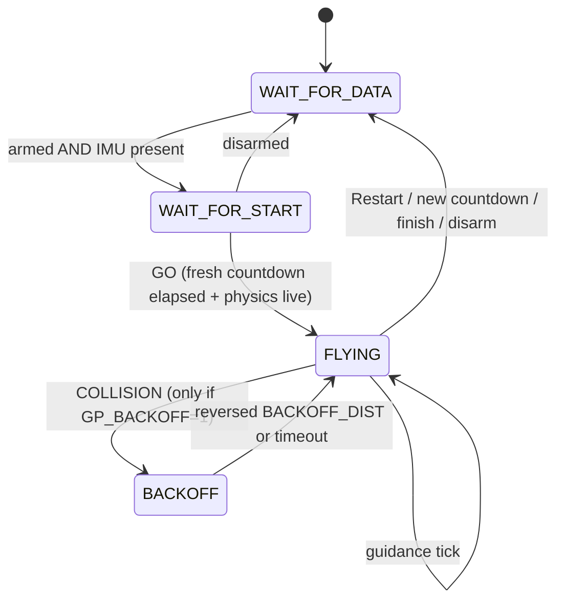

# GP Pilot (`auto_gp.py`) — Architecture & Algorithm Reference

The GP pilot is the classical, **vision-only** autonomous drone racer that flies the
VQ2 course with **no gate map and no ground-truth position** — it detects gates
from the camera (YOLO-pose → PnP), estimates its own state from the IMU, and
steers with a hand-tuned feedback controller. It is launched by `make control-flight`
(entry point `auto_gp.py`) and is the proven baseline (clears 4–5+ gates).

This document is a detailed, code-level description of how it works: the libraries,
the concurrent runtime, the full data path from sensors to motor commands, and the
control law itself.

---

## 1. Entry point & lifecycle

`auto_gp.py` (`make control-flight`):

1. Sets `AUTO_PILOT=gp` (selects `GPPilot` inside `Controller`) and `GP_DISPLAY`.
2. `setup_components(...)` builds and starts the whole stack (§3) and returns
   `{controller, mavlink_rx, vision_rx, ts_loop, sim_conn}`.
3. `controller.arm()`.
4. Main loop: `controller.update()` repeatedly (self-paced — see §7), plus an
   optional OpenCV vision window (`simulator/display.py`).
5. `Ctrl+C` → joins the RX threads and exits.

`controller.update()` is the heartbeat: each call runs one pilot tick (perception →
estimation snapshot → guidance) and sends exactly one attitude command.

---

## 2. Libraries

| Library | Version | Role in the GP pilot |
|---|---|---|
| **pymavlink** | ≥2.4.49 | MAVLink-2 over UDP. Inbound: `HIGHRES_IMU`, `RACE_STATUS`, `COLLISION` (and `ODOMETRY`/`ATTITUDE` on VQ1/Training). Outbound: `SET_ATTITUDE_TARGET` (setpoints), `COMMAND_LONG` (arm, message-interval requests), `HEARTBEAT` (GCS). |
| **ultralytics** (`YOLO`) | ≥8.4.84 | YOLO11n-pose CNN (`simulator/models/gate_pose.pt`) — detects each gate's 8 corner keypoints (inner+outer) + bounding box + confidence. |
| **torch / torchvision** | ≥2.6 (CUDA cu126) | YOLO inference backend. **GPU-required** — CPU inference is 100–350 ms/frame, too slow to track gates at racing speed. |
| **opencv-python** (`cv2`) | ≥4.13 | `solvePnPGeneric` (IPPE) + `solvePnPRefineLM` for gate pose; HSV gate segmentation (Anduril tracker); contour-based inner-corner refine; frame decode/annotate. |
| **numpy** | ≥2.4 | All vector/matrix math (frames, quaternions, filters). |
| **scipy** | ≥1.17 | Ancillary signal/geometry helpers. |
| **matplotlib** | ≥3.10 | Offline log/plot tooling (not in the flight loop). |
| **keyboard** | ≥0.13 | Manual-flight client only (`make manual`), not the GP pilot. |

> `gymnasium`, `stable-baselines3`, `tensorboard` are the (now-abandoned) RL stack
> and play **no part** in the GP pilot.

---

## 3. Runtime architecture — threads & the shared blackboard

The system is a set of **daemon threads communicating through one plain `dict`**
(`shared_data`, passed everywhere as `data`). There is no message bus; producers
overwrite keys and consumers read the latest value. Python's GIL makes a whole-dict
`data["k"] = new_obj` reference swap atomic, so single-key reads/writes need no lock
(the estimator additionally guards its multi-field snapshot with a `Lock`).



### Threads

| Thread | Source | Responsibility |
|---|---|---|
| **Main** | `auto_gp.py` → `Controller.update()` | Pilot tick + send one setpoint per iteration. Self-paces at `control_hz` (GP = **60 Hz**). |
| **MAVLinkRX** | `simulator/mavlink_rx.py` | `recv_match` loop; decode messages → `data["imu"]`, `data["race_status"]`, `data["active_gate_index"]`, `data["race_started"]`, `data["collision"]`/`data["last_collision"]`. |
| **VisionRX** | `simulator/vision_rx.py` | Bind camera UDP socket, reassemble chunked frames → `data["frame"] = {img, frame_id, ...}`; run HSV Anduril gate detector + `GateEstimator`; **spawn GatePoseRunner**. |
| **GatePoseRunner** | `simulator/gate_pose.py` | Newest-frame-wins YOLO-pose inference + PnP → `data["pose"] = {gates, annotated, frame_id, infer_ms}`. |
| **GPEstimation** | `simulator/gp_estimation.py` | 400 Hz IMU strapdown (attitude + velocity + position); pilot pulls an atomic `snapshot()`. |
| **TimeSync** | `simulator/timesync.py` | MAVLink `TIMESYNC` bookkeeping. |
| **GCS heartbeat** | `simulator/setup.py` | 1 Hz `HEARTBEAT` so the sim keeps streaming telemetry and accepting setpoints. |

### Connection handshake (`setup_components`)

1. Guard UDP 14550 (`udp_port_in_use`) → error if a stale client holds it.
2. `mavutil.mavlink_connection("udpin:ip:14550")`, send GCS heartbeats, wait for the
   sim's `HEARTBEAT` (≤60 s).
3. Start the persistent 1 Hz heartbeat thread.
4. Request `HIGHRES_IMU` at 100 Hz (`SET_MESSAGE_INTERVAL`); also request
   `ATTITUDE`/`LOCAL_POSITION_NED`/`ODOMETRY` (present only on VQ1/Training).
5. Construct `MAVLinkRX`, `TimeSync`, `VisionRX`, `Controller`.

---

## 4. End-to-end data flow (one control tick)



---

## 5. Component deep-dives

### 5.1 MAVLinkRX — telemetry ingest (`simulator/mavlink_rx.py`)
- `HIGHRES_IMU` → `data["imu"] = {ax,ay,az, gx,gy,gz, mx,my,mz, abs_pressure, pressure_alt, temperature, time_us}` (a fresh dict per message; accel/gyro in SI, `time_us` = sim sensor clock).
- `RACE_STATUS` → unpacks `(data_type, sim_boot_time_ms, race_start_boot_time_ms, race_finish_time_ns, active_gate_index, last_gate_race_time)`; writes `data["active_gate_index"]`, `data["race_started"] = race_start_boot_time_ms >= 0`, `data["race_finish_time_ns"]`, and the raw `data["race_status"]`. **This is the only gate-progress signal that survives VQ2.**
- `COLLISION` → `data["last_collision"] = (id, threat_level, horizontal_minimum_delta)` and `data["collision"] = {...}`. **Note:** this is a *proximity/threat* stream (fires ~3 m from a gate frame), not a hard-contact flag — the pilot ignores it by default (§5.7).

### 5.2 VisionRX — camera ingest (`simulator/vision_rx.py`)
- Binds the camera UDP port, reassembles chunked frames, publishes `data["frame"] = {img (BGR), frame_id, sim_time_ns, ...}`.
- Runs an **HSV/contour "Anduril" gate detector** (`AndurilGateTracker`) + `GateEstimator` inline (cheap) as a fallback vision source.
- Spawns `GatePoseRunner` (YOLO) on its own thread.

### 5.3 GatePoseRunner + gate_pose — YOLO detection (`simulator/gate_pose.py`)
- Loads `gate_pose.pt` (YOLO11n-pose) once, on CUDA.
- `_loop`: newest-frame-wins — grab the latest `data["frame"]`, skip any that piled up during the previous inference (so a slow inference never backs up the pipeline).
- `detect(img)`: YOLO `predict` → for each gate `{box, conf, keypoints (8×2), keypoint_conf, pose}` where **`pose` is solved in the detector thread** (so the 60 Hz control loop never runs PnP). Optional `_cv_refine_best`: replace the best gate's pose with a contour-corner PnP solve when `find_gate_inner_corners` locates the opening inside that box (sharper long-range depth).
- Publishes `data["pose"] = {gates, annotated, frame_id, infer_ms}`.

### 5.4 gate_pnp — corners → body-frame pose (`simulator/gate_pnp.py`)
This is the "no gate map" core: recover the gate's pose relative to the drone.
- **Intrinsics** (spec 3.8): `fx=fy=320, cx=320, cy=180` @ 640×360, no distortion.
- **Gate model:** 8 corners on the gate-local `z=0` plane — inner opening **1.5 m**, outer ring **2.7 m**. A **left/right label swap** is baked into the correspondence (the training data mislabeled L↔R; without the swap PnP solves a mirrored, back-facing pose).
- **Solve:** `estimate_pose` runs IPPE (`solvePnPGeneric`, two-fold planar ambiguity → pick lower reprojection) + one LM polish; rejects RMS reproj > 10 px or < 4 confident, non-edge corners.
- **Robust centre trick (`estimate_gate_pose`):** PnP gives **depth (metric scale)** reliably, but lateral/vertical position is reconstructed from the **gate-centre *pixel* + depth via the pinhole model** — the pixel is exactly where the gate is *seen*, so its left/right/up/down sign is correct regardless of the PnP label ambiguity. The centre pixel is:
  - all 4 inner corners → **diagonal intersection** (projective-exact centre),
  - a balanced diagonal pair → their midpoint,
  - otherwise (cropped near-gate) → `_edge_pair_centre`: reconstruct the centre from **one visible inner edge** (the opening centre sits 0.75 m perpendicular from an edge midpoint), depth from the edge's pixel length vs the known 1.5 m — method `"edge-pair"`. This keeps the *current* gate tracked down to ~1–2 m instead of vanishing and letting the pilot retarget a far gate mid-approach.
- **Frames:** camera-optical → body via `R_BODY_CAM` (fixed 20° up-tilt). Body is **FRD**: `x` forward, `y` right, `z` down. Output dict: `gate_pos_body`, `normal_body` (plane normal, sign-fixed toward the drone; fly-through axis = `-normal_body`), `range_m`, `yaw_bearing`, `pitch_bearing`, `reproj_px`, `method`.

### 5.5 gp_vision — which gate, and how clean (`simulator/gp_vision.py`)
- `best_pose_gate(data)`: among detected gates (conf ≥ min, reproj ≤ max, in front), take the `MAX_GATES_CONSIDERED` **nearest**, then pick the one minimizing `range + BEARING_COST_M_PER_RAD·|bearing|` — i.e. **nearest gate roughly on the course line**, not highest-confidence (a big far gate must not win at handoff).
- `_yolo_pose_estimate(data)`: wraps `best_pose_gate` into the estimate the pilot consumes (`body_x/y/z_m`, `normal_body`, `conf`, `source="yolo"`), rejecting stale pose packets (> `YOLO_STALE_GAP_FR` frames behind the camera).
- **Pass-through suppression (`YoloGateTracker`):** when a gate is very close (`bx < YOLO_NEAR_BX_M ≈ 2 m`) or its box fills the frame, publish **nothing** and stay blind for a cooldown — so the pilot threads the gate on held heading instead of being yanked toward the next gate's edge.
- The pilot layers an **EMA smoother**, **phantom rejection** (`_plausible_gate` drops far/post-pass background locks), and a **blue-ribbon/HSV fallback** that engages only when no usable gate is in view.

### 5.6 GPEstimation — self-state from IMU only (`simulator/gp_estimation.py`)
400 Hz daemon; the pilot reads an atomic `snapshot()`.
- **Attitude:** `GyroAHRS` integrates body rates → quaternion/euler. Gyro sign is sim-dependent (`GP_GYRO_SIGN`: **−1 for VQ2**, +1 for VQ1 — wrong sign spins attitude the wrong way → fly-away). Seeded at launch pitch **−17.8°**.
- **Velocity/position:** rotate SMA-smoothed accel (n=5) to NED, add gravity, integrate → `vel_ned`, `pos_ned`; rotate `vel_ned` back to body → `vel_body`. This is **pure dead-reckoning with no correction** — it drifts (and VQ2 accel is garbage under thrust), so guidance trusts `vel_body.x` only for *forward-speed regulation* and fuses **vision** for lateral/vertical; absolute position is not used for steering.
- `snapshot()` → `{att_deg, quat, pos_ned, vel_ned, vel_body, rates_body_dps}`.

### 5.7 Controller — command channels & wire (`simulator/controller.py`)
- Holds the pilot (`GPPilot` for `AUTO_PILOT=gp`) and a `control_mode`. `update()` = `pilot.tick()` → auto-arm if disarmed → send per mode → **`time.sleep(1/control_hz)`** (self-pacing; GP sets `control_hz=60`).
- The GP pilot uses **`attitude_quat`** mode: `set_attitude_quat_deg(roll,pitch,yaw,thrust)` stores the Euler command; `_send_attitude_quat` converts Euler→quaternion and sends `SET_ATTITUDE_TARGET` with the body-rate fields masked out (`ATT_QUAT_TYPE_MASK`), `thrust` in `[0,1]`.
- `arm()` / disarm via `COMMAND_LONG`.

---

## 6. GPPilot — the flight brain (`simulator/gp_pilot.py`)

### 6.1 Phase state machine



- **WAIT_FOR_DATA:** hold `(0,0,0,0)`; re-arm every `ARM_RETRY_S=1 s`; once armed + IMU seen, start `GPEstimation` → `WAIT_FOR_START`.
- **WAIT_FOR_START (GO detection):** hold on the pad. Compute GO from `RACE_STATUS`:
  - `anchor = sim_ms` on entry (re-anchor if the sim clock resets, `sim_ms < anchor − 500 ms` — a Restart Race),
  - `race_fresh = race_start_ms > 0 and race_start_ms >= anchor` (ignore a stale/finished race),
  - `countdown_done = race_fresh and sim_ms >= race_start_ms and finish_ns < 0`,
  - `physics_live` = the `HIGHRES_IMU` timestamp is still advancing (frozen > `IMU_FROZEN_S=2 s` ⇒ sim physics idle; flying commands into a frozen clock tips the drone at launch).
  - `GO = countdown_done and physics_live` → `_enter_flying`.
- **FLYING:** each tick — take estimator `snapshot()`, resolve the vision target (§5.5), call `compute_guidance` (§6.2), slew-limit, `set_attitude_quat_deg`. Also: persistent-disarm detection (re-arm on sim reset, debounced `DISARM_PERSIST_S`), abort back to WAIT on Restart/new-countdown/finish, `SEARCH` yaw sweep when the gate is lost, HSV/ribbon fallback.
- **BACKOFF (opt-in, `GP_BACKOFF=1`):** reverse `BACKOFF_DIST_M` after a collision, then re-acquire. **Default OFF** — reversing lost all progress; the pilot instead consumes the collision event and keeps flying forward.

### 6.2 The control law (`compute_guidance`)

Feedback controller producing `(roll_cmd, pitch_cmd, yaw_cmd, thrust)` in **degrees**
(+ thrust). Body frame FRD; gate position `(bx, by, bz)` = forward/right/down.

**Sign convention (critical):** `KP, KR, KY = +1, −1, −1` — the sim's **roll and yaw
are inverted**, absorbed by the −1 gains. Commands are *feedback corrections*
`K·(desired − current)`, which self-limit as the attitude reaches the target.

**Lateral (→ roll):**
```
bearing      = clip(atan2(by, bx), ±25°)
blend        = clip(bx / PERP_BLEND_DIST(6m), 0..1)     # trust bearing more far out
by_pred      = by − vY·t_lead,  t_lead = clip(bx/vX, ≤0.6s)   # aim where the gate WILL be
desired_roll = clip(K_BEARING(2.5)·bearing_ctrl·blend − K_LAT_D(5)·d_lat·blend, ±MAX_BANK(14°))
roll_cmd     = (desired_roll − roll_deg)·KR            # KR = −1
# blind (no vision / suppressed): desired_roll = clip(−K_BLIND_VY_DEG(8)·vY, ±10°)  (null sideslip)
```

**Longitudinal (→ pitch, i.e. forward speed):**
```
v_target  = THRU(1.2) + (CRUISE(2.2) − THRU)·ease·vert_ok·lat_ok , capped at 10 km/h
            # ease = bx/5m; vert_ok, lat_ok shrink speed when not vertically/laterally settled
pitch_des = clip(DESIRED_PITCH(−2°) − K_SPEED_P(2.5)·(v_target − vX) + K_SPEED_D(0.6)·a_fwd,
                 −2.5°..+6°)
pitch_cmd = clip((pitch_des − pitch_deg)·KP, ±PITCH_WIRE_MAX(18°))   # KP = +1
```

**Vertical (→ thrust):** PID on the gate's vertical offset (`bz`), integral trim, with
descent-rate cap and a floor safety net:
```
thrust = (hover(0.264) + elev_i − elev_err·K_P_THRUST(0.03) + d_vert·K_D_THRUST(0.045)) / tilt
# elev_i: slow I-trim (K_I 0.006, seeded 0.006) integrated only when a gate is actively ranged
# tilt   = cos(roll)·cos(pitch)  (thrust-vector projection)
# guards: no thrust below hover while sinking > MAX_DESCENT_RATE(0.8 m/s); blend climb thrust
#         when < FLOOR_CLEARANCE(0.8 m) above the GO-time floor (unless a fresh gate is below)
```

**Yaw:** point at the gate, blending bearing with the gate's plane tilt near the gate:
```
yaw_err = blend·clip(bearing, ±12°) + (1−blend)·gate_tilt_deg(from normal_body)
yaw_cmd = yaw_err·KY                                   # KY = −1
```

**Smoothing/robustness:** gate-position + attitude-command EMA; command **slew limit**
`CMD_SLEW_DEG_S=90`, `THRUST_SLEW_PER_S=1` (kills bank twitch on YOLO flicker);
vision-velocity de-rotation (`v_true = v_vision − ω_z·bx`, accepted only if it shrinks
`|vY|`); `LEAN_RAMP_S=2.5 s` post-GO no-dive guard (IMU `vX≈0` right after reset would
otherwise saturate pitch and open-loop dive).

---

## 7. Loop rates & timing

| Stream | Rate | Notes |
|---|---|---|
| Control / command send | **60 Hz** (`GP_CONTROL_HZ`) | Self-paced by `Controller.update()`'s `sleep(1/control_hz)`. Spec cap 100 Hz. |
| IMU (`HIGHRES_IMU`) | 100 Hz requested | Drives GPEstimation. |
| GPEstimation | 400 Hz poll | Integrates whatever IMU is latest. |
| Camera | 30 Hz, 640×360 | YOLO runs newest-frame-wins (inference ~40–130 ms), so effective detection ≈ 8–25 Hz. |
| GCS heartbeat | 1 Hz | Keeps the sim streaming. |

The sim runs in its **own process on its own clock**; the client observes and injects
asynchronously over UDP — there is no lockstep, and command timing relative to sim
physics is not deterministic run-to-run.

---

## 8. Constants & tuning (from `gp_pilot.py`)

| Constant | Value | Meaning |
|---|---|---|
| `HOVER_THRUST` | 0.264 | Feed-forward hover thrust (Anduril-measured trim). |
| `MAX_BANK_DEG` | 14 | Roll (bank) clamp. |
| `K_BEARING` | 2.5 | deg desired-roll per deg gate bearing. |
| `K_LAT_D` | 5.0 | Lateral rate damping. |
| `PERP_BLEND_DIST` | 6 m | Range over which bearing authority ramps in. |
| `DESIRED_PITCH_DEG` | −2 | Baseline forward lean. |
| `PITCH_DES_MIN/MAX` | −2.5 / +6 | Desired-pitch clamp. |
| `PITCH_WIRE_MAX_DEG` | 18 | Pitch command clamp. |
| `K_SPEED_P / K_SPEED_D` | 2.5 / 0.6 | Forward-speed P/D → pitch. |
| `MAX_SPEED_MPS` | 2.78 (10 km/h) | Hard speed cap. |
| `CRUISE / THRU / BLIND` | 2.2 / 1.2 / 1.0 m/s | Target speeds by situation. |
| `K_P/K_D/K_I_THRUST` | 0.03 / 0.045 / 0.006 | Elevation PID → thrust. |
| `MAX_DESCENT_RATE_MPS` | 0.8 | Sink-rate cap. |
| `FLOOR_CLEARANCE_M` | 0.8 | Floor safety-net trigger. |
| `KP, KR, KY` | +1, −1, −1 | Wire-gain signs (roll+yaw inverted). |
| `CMD_SLEW_DEG_S` | 90 | Attitude command slew limit. |
| `GP_CONTROL_HZ` | 60 | Command rate. |
| `IMU_FROZEN_S` | 2.0 | Physics-idle detection. |
| `CLOCK_RESET_SLACK_MS` | 500 | Restart-Race clock-reset threshold. |
| `YOLO_NEAR_BX_M` | ~2.0 | Near-gate pass-through suppression range. |

---

## 9. Frames & conventions

- **Body frame = FRD:** `x` forward, `y` right, `z` down.
- **Gate position** `gate_pos_body = (bx, by, bz)`; **fly-through axis** = `−normal_body`.
- **Camera:** optical frame, `+x` right, `+y` down, tilted **20° up** from body; `R_BODY_CAM` handles the mapping.
- **Attitude command** on the wire is absolute Euler (deg) → quaternion; the pilot's *values* are feedback corrections `K·(desired − current)`, and the sim inverts roll & yaw (hence `KR=KY=−1`).
- **Only signals that survive VQ2:** `HIGHRES_IMU`, camera, `RACE_STATUS`/`active_gate_index`, `COLLISION`, `HEARTBEAT`/`TIMESYNC`. No odometry, attitude, or gate map.

---

## 10. Key design decisions (why it's built this way)

- **PnP depth + pixel-centre reconstruction** instead of trusting PnP translation: sidesteps the YOLO L/R keypoint-label ambiguity that would otherwise mirror the gate to the wrong side.
- **Edge-pair fallback** keeps the *current* gate tracked to ~1–2 m so the pilot commits to it instead of retargeting a far gate mid-approach (the dominant mid-course clip).
- **Nearest-ahead gate selection** (not highest-confidence) prevents a big far gate from stealing the lock at handoff.
- **Pure IMU dead-reckoning + vision fusion in the controller**, not an EKF: VQ2's accel is unusable under thrust and there's no position aiding, so absolute state is untrusted; the controller leans on vision laterally and IMU only for forward-speed regulation.
- **Feedback (self-limiting) attitude commands** `K·(desired − current)` give stable flight without an inner attitude-rate loop — this is exactly the stability an RL policy struggled to learn when it emitted absolute attitude instead.
- **Collision events ignored by default:** they are proximity warnings that fire while threading a gate; reacting to them flew the drone backward "into oblivion."
- **Vendor-faithful GO detection** (fresh countdown + live physics clock) so the pilot arms and launches at the real race start, not during the 3 s countdown or on a stale/finished race.
