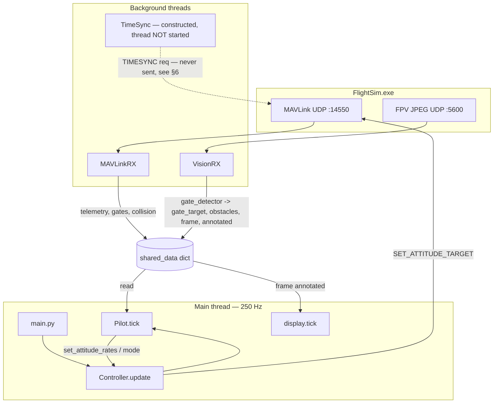

# Main Branch Documentation

Living reference for what is **merged on `main`** today. Update this file when features land on `main` — not when they exist only on feature branches or locally.

| Field | Value |
|-------|-------|
| **Last updated** | 2026-06-28 |
| **Main commit** | `b0e71bc` — *vision extension added as a window so you can see what your drone is detecting (#8)* |
| **Maintainer note** | Add a one-line entry to [Changelog](#changelog) per substantive merge to `main`. |

---

## Table of contents

1. [Purpose](#1-purpose)
2. [Quickstart](#2-quickstart)
   - [Choosing an entry point](#25-choosing-an-entry-point)
   - [Troubleshooting](#26-troubleshooting)
3. [Repository layout](#3-repository-layout)
4. [System architecture](#4-system-architecture)
5. [`shared_data` schema](#5-shared_data-schema)
6. [Module reference — `simulator/`](#6-module-reference--simulator)
7. [Module reference — `rl/`](#7-module-reference--rl)
8. [External interfaces](#8-external-interfaces)
9. [Control modes](#9-control-modes)
10. [Makefile targets](#10-makefile-targets)
11. [Dependencies & tooling](#11-dependencies--tooling)
12. [Current capabilities & gaps](#12-current-capabilities--gaps)
13. [How to update this doc](#13-how-to-update-this-doc)
14. [Changelog](#changelog)

---

## 1. Purpose

This repo is the **ANDURIL** team's autonomous pilot for the [AI Grand Prix](https://www.theaigrandprix.com/) competition. As of the commit above, `main` holds **two working flight paths plus an offline RL pipeline**:

- **`simulator/` — the live pilot.** `make sim` runs a self-contained, vision-first gate racer (`simulator/pilot.py`) driven at 250 Hz over MAVLink. It fuses HSV gate detection from the FPV camera with the sim's odometry + broadcast gate map, and falls back to a telemetry-only nearest-gate chase when vision is unavailable. A **live OpenCV window** (`simulator/display.py`) shows annotated camera frames while you fly; sessions optionally record to `runs/vision.mp4`.
- **`rl/` — an 8-module RL/vision research pipeline** (Modules 1–8): live-sim interface, dataset auto-labeling, a GateNet U-Net segmenter, PnP pose, an error-state EKF, a 24-D observation builder, a Gymnasium training env, and PPO training + deployment. It also ships several scripted classical controllers (`fly2`, `fly_geometric`, `fly_odom`) and live diagnostics.

The autonomy that earlier revisions of this doc described as "on feature branches" is now merged. For the competition's MAVLink message contract, see [SPEC.md](../SPEC.md). For competition context (timeline, hardware, rules), see [docs/Instructions.md](Instructions.md).

> **Wired vs. present.** Three `simulator/` modules — `state_machine.py`, `gate_estimator.py`, `search.py` — are committed but **not imported by the live `make sim` path**; they are a separate state-machine pilot design. The shipping `pilot.py` carries its own state logic. See [§6](#6-module-reference--simulator).

---

## 2. Quickstart

**Prerequisites:** [uv](https://docs.astral.sh/uv/), Python ≥ 3.13. On Windows, use PowerShell and install `make` via `choco install make`.

```bash
make          # uv sync — install dependencies
make check    # ruff lint (--fix) + format
make sim      # connect to FlightSim.exe and run the live pilot
```

**Before `make sim`:**

1. Launch **FlightSim.exe** from your AI-GP Simulator install.
2. Log in and start a qualifier / flight session (not just the main menu).
3. Ensure nothing else is bound to UDP **14550** (MAVLink) or **5600** (vision).

`make sim` waits for a MAVLink heartbeat, arms the drone, opens a **"drone vision"** debug window, then runs the 250 Hz control loop until the process is killed. On exit, the window closes and an mp4 may be written under `runs/` (gitignored).

For which command to run and what to do when something fails, see [§2.5](#25-choosing-an-entry-point) and [§2.6](#26-troubleshooting). Full target list: [§10](#10-makefile-targets).

### 2.5 Choosing an entry point

`main` ships several pilots and tools. Pick by goal — not every path needs vision or a saved gate map.

| Goal | Command | Live sim? | Vision? | Gate map? | Notes |
|------|---------|-----------|---------|-----------|-------|
| **Default competition pilot** | `make sim` | Yes | Yes | From sim at race start | Vision-first gate racer + **live annotated vision window**. What `main.py` runs. |
| Hover / controller sanity check | `make hover` | Yes | No | Optional | `rl.fly2 --mode hover`; includes vision window when frames arrive. |
| Full course, measured dynamics | `make fly` | Yes | No | `rl/data/gate_map.json` | `rl.fly2 --mode course`; **live vision window** + optional `runs/vision.mp4`. |
| Full course, geometric controller | `uv run -m rl.fly_geometric` | Yes | No | `gate_map.json` | Cascaded geometric controller + odom. |
| Full course, pilot-style + odom | `uv run -m rl.fly_odom` | Yes | No | `gate_map.json` | Same control style as `pilot.py`, driven by telemetry only. |
| Capture gate map for offline tools | `make capture-gates` | Yes | No | **Writes** `gate_map.json` | Run **before** (re)starting the race; see [§2.6](#26-troubleshooting). |
| Telemetry snapshot | `make capture` | Yes | Optional | From sim | Module 1 smoke — dumps live state once. |
| Plant characterization | `make dynamics` | Yes | No | No | Open-loop thrust/rate ID for `fly2`. |
| Train + fly learned policy | see recipe below | Mixed | Optional | `gate_map.json` for deploy | Offline training; live sim only for eval. |
| Offline module smoke tests | `make rl-test` | No | No | No | Runs `rl.* --selftest` without FlightSim. |

**Gate map:** The sim broadcasts the track once at race start. `make sim` receives it live into `shared_data["track_gates"]`. The `rl/` course scripts and `make fly` read a saved copy at `rl/data/gate_map.json` — capture it with `make capture-gates` if missing.

**RL train-and-deploy recipe** (offline unless noted):

```text
make capture-gates          # live sim — start race while this listens
make dataset                # live sim — records frames + auto-labeled masks
make train-gatenet          # offline → rl/data/gatenet.pt (optional vision fusion)
make train-ppo              # offline → rl/data/policy.pt
make fly-policy             # live sim — EKF + policy; odom default, GateNet if present
```

`gatenet.pt` is optional; `make fly-policy` uses sim odometry by default. `policy.pt` is checked in, but retraining overwrites it.

### 2.6 Troubleshooting

#### Before you debug

1. FlightSim.exe is running; you are logged in and in an **active qualifier / flight** (not the main menu).
2. Ports **14550** (MAVLink) and **5600** (FPV JPEG) are free — no other pilot or capture tool bound.
3. For `make fly` / `fly_odom` / `fly_geometric`: `rl/data/gate_map.json` exists (run `make capture-gates` first).
4. For `make capture-gates`: start the tool **first**, then start or restart the race so the burst is not missed.

#### Symptom → cause → fix

| Symptom | Likely cause | What to do |
|---------|--------------|------------|
| Hangs on `Waiting for heartbeat...` | Sim not running, wrong session, or port 14550 taken | Launch sim, enter a flight, kill other MAVLink clients |
| `Connected` then hovers; never chases gates | `track_gates` empty — race not started | Start/restart the race while the pilot is connected |
| `make fly` errors or wanders | Missing or stale `gate_map.json` | `make capture-gates`, restart race during capture window |
| `NO gate burst captured` | Race started before capture tool, or window expired | Run `make capture-gates` first; restart race within the listen window (default 150 s) |
| Never enters vision mode | No frames on :5600 or HSV miss | Confirm `Listening for camera frames...`; point drone at orange gate; tune HSV in `config.py` |
| `Failed to decode frame` | Corrupt/partial JPEG chunk | Usually transient; check nothing else is consuming :5600 |
| Spins in place after a gate | Expected — search mode re-acquiring | Wait for `SEARCH → new gate acquired`; or check next gate is visible |
| Collision then slow hover | `collision_hold` (2 s reduced thrust) | Normal; clears automatically |
| `make fly-policy` drifts / weak | No `gatenet.pt`; policy trained on internal model | Train GateNet locally; re-run `make train-ppo`; expect sim-to-sim gap |
| Process won't exit cleanly | No `KeyboardInterrupt` handler in `main.py` | Kill the terminal/process; `display.close()` runs in `finally` (see [§12](#12-current-capabilities--gaps)) |
| Vision window blank / missing | No frames yet, or headless environment | Wait for race + camera; OpenCV GUI needs a desktop session on Windows |

#### Expected console output

**Startup (`make sim`):**

```text
Waiting for heartbeat...
Connected to system: …
Setting up MAVLink rx...
Setting up Timesync loop...
Listening for camera frames...
Arming drone...
Starting control loop...
[pilot] init done, waiting for armed + vision/telemetry
```

**Healthy flight (`[pilot]` lines):**

| Log line | Meaning |
|----------|---------|
| `NEW TARGET gate {id}` | Telemetry fallback locked onto next gate |
| `GATE CENTERED, holding …` | Aligning before advancing through gate |
| `ADVANCE → gate area large, bypassing stabilize` | Close enough; skipping hold phase |
| `FLY-THROUGH at pos=…` | Passed gate; entering post-gate hover |
| `POST-GATE hover done, entering SEARCH` | Scanning for next gate |
| `SEARCH sweep dir=CW/CCW` | Yaw sweep during search |
| `SEARCH → new gate acquired (nx=…)` | Vision re-acquired; back to vision mode |
| `Passed gate re-detected, entering SEARCH` | Old gate still in frame after pass; ignoring until new gate found |

**Vision thread:** `Listening for camera frames...` must appear. If absent, the vision thread failed to bind :5600.

#### Race lifecycle (why `track_gates` matters)

```text
Enter flight session → start race → sim sends gate-map burst (type 2 ENCAPSULATED_DATA)
                                 → mavlink_rx fills shared_data["track_gates"]
                                 → race status updates active_gate_index / race_started
```

`make sim` needs the burst for telemetry fallback (`pilot.py` chases nearest gate from `track_gates`). Vision can work with only the camera, but course progress without a map is unreliable. Offline `rl/` scripts always need `gate_map.json` from `make capture-gates`.

---

## 3. Repository layout

Files tracked on `main` as of the snapshot above (omitting `rl/data/` binaries):

```
docs/
  Instructions.md         # Competition overview, sim setup, timeline
  main-documentation.md   # This file
simulator/                # LIVE pilot (what `make sim` runs)
  __init__.py
  setup.py                # Component wiring (conn, RX threads, controller)
  controller.py           # 250 Hz loop; motor / attitude / position senders
  pilot.py                # Vision+telemetry gate racer (drives controller)
  mavlink_rx.py           # MAVLink receive thread -> shared_data
  vision_rx.py            # FPV JPEG receiver -> gate_detector -> shared_data + annotated overlay
  display.py              # Live cv2 window + optional runs/vision.mp4 recording
  gate_detector.py        # HSV orange-gate detection
  transforms.py           # Quaternion / frame / bearing / focal helpers
  config.py               # Tunables + GateDetection/DroneState/TrackGate types
  timesync.py             # TIMESYNC request loop (defined 10 Hz; NOT started by setup.py)
  gate_estimator.py       # NOT wired into live pilot (alt design)
  state_machine.py        # NOT wired into live pilot (alt design)
  search.py               # NOT wired into live pilot (alt design)
rl/                       # Offline RL/vision pipeline (Modules 1-8) + tools
  __init__.py
  spec.py                 # Single source of truth: intrinsics, frames, layouts
  sim_interface.py        # Module 1 — live-sim snapshot + actuation
  dataset.py              # Module 2 — frames + auto-labeled gate masks
  gatenet.py              # Module 3 — GateNet U-Net segmenter
  pnp.py                  # Module 4 — corner detection + PnP pose
  ekf.py                  # Module 5 — error-state EKF (INS + vision)
  observation.py          # Module 6 — 24-D gate-relative observation
  env.py                  # Module 7 — Gymnasium env + curriculum
  train_ppo.py            # Module 8 — PPO training -> policy.pt
  deploy.py               # Module 8 — run trained policy on live sim
  control.py              # Geometric cascaded controller (expert/baseline)
  fly2.py                 # Measured-dynamics controller (hover / course)
  fly_geometric.py        # Course flight via geometric controller + odom
  fly_odom.py             # Course flight, pilot.py-style control + odom
  dynamics_id.py          # Open-loop plant characterization
  calibrate_cam.py        # Focal length + camera-tilt calibration
  capture_gates.py        # Capture race-start gate-map burst -> gate_map.json
  diag_mav.py             # Raw MAVLink dump diagnostic
  diag_project.py         # Gate-projection-vs-frame validation
  data/                   # gate_map.json, policy.pt, projection check PNGs
main.py                   # Entry point (setup -> arm -> 250 Hz loop + vision window)
runs/                     # Gitignored — vision.mp4 recordings from display.py
SPEC.md                   # Competition MAVLink message contract
diagnostics.log           # Stray runtime log (tracked; see §12)
skills-lock.json          # Agent skills lockfile
Makefile                  # install, check, sim + fly / RL targets
pyproject.toml / uv.lock  # Dependencies (uv)
.github/workflows/ruff.yml# CI: ruff lint on push/PR to main
AGENTS.md / CLAUDE.md     # Agent / contributor rules
.agents/skills/deslop/    # Pre-commit cleanup skill
```

---

## 4. System architecture



### Startup sequence (`main.py`)

1. Create empty `shared_data` dict.
2. `setup_components()` — open `udpin` MAVLink connection, **wait for heartbeat**, start the `MAVLinkRX` and `VisionRX` threads, construct `TimeSync` (whose thread is *not* started — see [§6](#6-module-reference--simulator)), and construct the `Controller` (which instantiates `Pilot`).
3. `controller.arm()` — `MAV_CMD_COMPONENT_ARM_DISARM`.
4. `display.start()` — create the **"drone vision"** OpenCV window (must run on the main thread).
5. `try` / `finally` loop at 250 Hz: each tick runs `controller.update()`; on each **new** `shared_data["frame"]`, call `display.tick(annotated_or_raw, elapsed)` so overlays stay in sync with perception.
6. `finally`: `display.close()` finalizes the mp4 writer; then join RX threads with 1 s timeouts.

There is still **no graceful `KeyboardInterrupt` handler**; killing the process triggers `finally` and closes the window/mp4.

---

## 5. `shared_data` schema

`shared_data` is the cross-thread blackboard created in `main.py`. RX threads write it; `Pilot` reads it. Keys populated on `main`:

| Key | Writer | Contents |
|-----|--------|----------|
| `armed` | `mavlink_rx.on_heartbeat` | bool from HEARTBEAT base_mode |
| `attitude` / `yaw_rad` / `yaw_rate` / `att_time_ms` | `on_attitude` | roll/pitch/yaw + rates |
| `pos_ned` / `vel_ned` / `has_position` / `pos_time_ms` | `on_local_position_ned` | NED position + velocity |
| `odometry` | `on_odometry` | pose, quaternion, body velocities, angular rates |
| `imu` | `on_highres_imu` | accel + gyro (FRD), consumed by the EKF |
| `active_gate_index` / `race_started` / `race_finish_time_ns` / `race_status` | `on_race_status` | race timing + current target gate |
| `gates` / `track_gates` | `on_track_data` | full gate map (NED pose, quat, width, height) |
| `collision` / `last_collision` | `on_collision` | id, threat level, delta |
| `camera` / `frame` | `vision_rx.process_frame` | `{img, frame_id, sim_time_ns, received_at, annotated?}` — BGR arrays; `annotated` has gate bbox, obstacle circles, HUD |
| `gate_target` | `vision_rx.process_frame` | `{detected, nx, ny, r_frac}` (normalized gate centroid + area fraction) |
| `obstacles` | `vision_rx.process_frame` | list of `{nx, ny, r_frac}` dark blobs near center |

---

## 6. Module reference — `simulator/`

### `main.py`

Entry point. Builds `shared_data`, wires components, arms, starts the vision window, and runs the 250 Hz loop. Pumps `display.tick()` on each new camera frame. `try` / `finally` ensures `display.close()` on exit. No CLI arguments.

### `display.py`

Live perception debug UI. `start()` opens a cv2 window named **"drone vision"**; `tick(frame, elapsed)` shows the frame (annotated when available) and optionally appends to `runs/vision.mp4` (`RECORD = True` by default, 30 fps). **All cv2 calls run on the main thread** — never call from `VisionRX`. Used by `main.py` and `rl/fly2.py`.

### `setup.py`

`setup_components()` opens `udpin:127.0.0.1:14550`, waits for heartbeat, then returns a dict of `sim_conn`, `mavlink_rx`, `ts_loop` (TimeSync), `vision_rx`, and `controller`. The `Controller` constructor instantiates the `Pilot`.

### `controller.py`

Runs at **250 Hz** (`CONTROL_HZ`). `Controller.update()` calls `pilot.tick()` each cycle, then sends exactly one setpoint based on `control_mode`:

| Mode | Sender | MAVLink |
|------|--------|---------|
| `motor` | `update_motor_control` | `SET_ACTUATOR_CONTROL_TARGET` (hard-coded RPMs) |
| `attitude` | `_send_attitude_rates` | `SET_ATTITUDE_TARGET` (body rates + thrust) |
| `position` | `_send_velocity_ned` | `SET_POSITION_TARGET_LOCAL_NED` (NED velocity) |

Default mode is `motor`, but `Pilot` switches it to `attitude` on construction, so the live flight path is attitude-rate control. Also exposes `arm()`, `set_control_mode()`, `set_attitude_rates()`, `set_velocity_ned()`, and `send_sim_reset_command()` (`MAVLINK_CMD_SIM_RESET = 31000`).

### `pilot.py`

The shipping gate racer. `tick()` runs every cycle and selects one behavior (exposed as `_mode_str`):

- **`disarmed`** — hover until armed.
- **`collision_hold`** — on a `collision` event, hold reduced thrust for `COLLISION_HOLD_S` (2 s).
- **`post_gate_hover`** — after a fly-through, hover ~2.5 s, then enter search.
- **`vision`** (highest priority) — fly toward `gate_target` from the camera: yaw-rate proportional to horizontal offset `nx`, altitude PID nudged by `ny`, forward pitch scaled by alignment. Fly-through is detected when the gate's area fraction `r_frac` peaks then drops; the gate is marked complete and recorded in an internal passed-gate position map.
- **`search`** — alternating yaw sweep (with gentle forward creep after warm-up) to re-acquire the next gate.
- **`telemetry`** (fallback) — when no usable detection, pick the nearest not-yet-completed gate from `track_gates` by 3-D distance to odometry and chase its bearing.
- **`no_target`** — hover.

Altitude is held by a PID on thrust (`_altitude_thrust`, `KP_Z`/`KI_Z`/`KD_Z` with anti-windup) targeting the gate/hold altitude. Already-passed gates are rejected by proximity + bearing match so the pilot doesn't re-chase a gate it flew through.

### `mavlink_rx.py`

Background thread; non-blocking `recv_match`. Parses messages and **writes telemetry into `shared_data`** (see [§5](#5-shared_data-schema)). Handles HEARTBEAT, TIMESYNC, ATTITUDE, LOCAL_POSITION_NED, ODOMETRY, HIGHRES_IMU, ENCAPSULATED_DATA (race status type 1 / track info type 2), DATA_TRANSMISSION_HANDSHAKE (chunk reassembly), ACTUATOR_OUTPUT_STATUS, COLLISION.

Binary layouts: race status `struct "<BQqqIq"` (`data_type`, sim boot ms, race start boot ms, race finish ns, active gate index, last gate race time); per-gate track entry `"<Hfffffffff"` (38 bytes: `gate_id`, NED x/y/z, NED quat w/x/y/z, width, height).

### `vision_rx.py`

Listens on `0.0.0.0:5600` for chunked JPEG. Header `"<IHHIIQ"`: `frame_id`, `chunk_id`, `total_chunks`, `jpeg_size`, `payload_size`, `sim_time_ns`. Reassembles, decodes with OpenCV, then `process_frame()` runs `gate_detector.detect_gate`, writes `gate_target` (normalized centroid `nx`/`ny` + area fraction `r_frac`), stores `frame` (raw BGR + metadata), draws **`_annotate()`** overlays (gate rectangle, obstacle circles, HUD text) into `frame["annotated"]`, and extracts dark-blob `obstacles`.

### `gate_detector.py`

`detect_gate()` — HSV threshold for the orange gate (`GATE_HEX_COLOR = #F3390F`, with hue-wraparound handling) → morphological open+close → contour filter on area and aspect ratio → returns the best-scoring contour's centroid/area/bbox as a `GateDetection`, or `None`.

### `transforms.py`

Pure helpers: `hex_to_hsv_lower_upper`, `quat_to_yaw`, `body_to_ned_velocity` / `ned_velocity_to_body`, `bearing_to_yaw_delta`, `pixel_offset_to_bearing`, `estimate_focal_from_track`.

### `config.py`

Tunables (HSV bounds, control gains, search/altitude params, `DEBUG`) plus the shared dataclasses `GateDetection`, `DroneState`, `TrackGate`.

### `timesync.py`

Defines a `TimeSync` thread that *would* send `TIMESYNC` requests at **10 Hz** (`TIMESYNC_REQUEST_HZ`) — but only when started via the `create_timesync` classmethod. **`setup.py` constructs it with the plain `TimeSync(...)` constructor instead, which never starts the thread**, so on the live `make sim` path no TIMESYNC requests are actually sent and the loop is dormant. (Consequently the unreachable `ts_loop.get_thread_for_join().join()` in `main.py` would hit `None.join()` if the main loop ever exited — it doesn't.) See [§12](#12-current-capabilities--gaps).

### `gate_estimator.py`, `state_machine.py`, `search.py` — present, not wired

A self-contained alternative pilot design: `GateEstimator` (self-calibrating focal length → bearing/range), a pure `transition()` state machine (`TAKEOFF/CHASE/ADVANCE/SEARCH`), and an `ExpandingSearch` policy. **None are imported by `pilot.py`, `controller.py`, `setup.py`, or `main.py`** — the live pilot does not use them. Keep that in mind before assuming they affect `make sim`.

---

## 7. Module reference — `rl/`

The `rl/` package is an offline-trainable pipeline. `rl/spec.py` is the single source of truth for camera intrinsics, frame conventions, gate geometry, and the action/observation layouts shared across modules. Action space is **attitude-rate + thrust** (the only channel this sim actuates on). Each module has a `--selftest` or smoke entry point; `make rl-test` runs them without a live sim.

| Module | File | Role |
|--------|------|------|
| 1 | `sim_interface.py` | Live-sim snapshot (IMU/attitude/vel/pose/frame + gate map) + actuation |
| 2 | `dataset.py` | Fly the vision pilot, record frames + auto-labeled gate masks (projected from gate map + pose) |
| 3 | `gatenet.py` | Train a small U-Net (`gatenet.pt`) for gate segmentation |
| 4 | `pnp.py` | Extract gate corners, solve PnP for a vision pose / world-position measurement |
| 5 | `ekf.py` | Error-state EKF: IMU strapdown predict, vision + attitude updates |
| 6 | `observation.py` | Build the 24-D gate-relative observation (`spec.OBS_LAYOUT`) |
| 7 | `env.py` | Gymnasium env over a lightweight internal quadrotor model + 3-stage curriculum |
| 8 | `train_ppo.py` | PPO (SB3, 3×64 MLP) over the curriculum → `policy.pt` |
| 8 | `deploy.py` | Run the trained policy on the live sim (EKF → obs → policy → attitude rates) |

**Scripted controllers & tools** (not the learned policy):

- `control.py` — geometric cascaded controller; expert/baseline/fallback.
- `fly2.py` — controller built from measured sim dynamics; `hover` and `course` modes; **includes live vision window** via `display.py`.
- `fly_geometric.py` — fly the course with the geometric controller + odometry + gate map (no vision).
- `fly_odom.py` — fly the course with `pilot.py`-style control driven by odometry + gate map.
- `dynamics_id.py` — open-loop plant characterization (hover thrust, rate→angle sign/scale).
- `calibrate_cam.py` — focal length + camera tilt against the real gate.
- `capture_gates.py` — capture the race-start gate-map burst → `rl/data/gate_map.json`.
- `diag_mav.py` / `diag_project.py` — raw MAVLink dump / gate-projection-vs-frame validation.

> **Note:** `env.py` trains against an **internal** physics model, not the Anduril sim (per-step sim calls would be far too slow). The live sim is used only for data collection (Modules 1–2) and final evaluation. Domain randomization covers the sim-to-sim gap.

---

## 8. External interfaces

### MAVLink (inbound UDP `127.0.0.1:14550`)

Client acts as GCS: listens on `udpin`, waits for heartbeat, arms, and streams `SET_ATTITUDE_TARGET` (live pilot) / other setpoints. See [SPEC.md](../SPEC.md) for the competition's message contract.

### FPV vision (inbound UDP `0.0.0.0:5600`)

Chunked JPEG. Decoded per frame and fed to `gate_detector`; the raw frame is also retained for GateNet/dataset use.

### Gate map

Broadcast by the sim as a short burst at race start (DATA_TRANSMISSION_HANDSHAKE + ENCAPSULATED_DATA type 2). `mavlink_rx` reassembles it into `shared_data["track_gates"]`; `rl/capture_gates.py` can snapshot it to `rl/data/gate_map.json` for offline use.

---

## 9. Control modes

`Controller.update()` emits one setpoint per tick for the active `control_mode` (`motor` / `attitude` / `position`). The live `Pilot` uses **`attitude`** mode: body-rate commands (roll/pitch/yaw rate) plus a thrust value from the altitude PID, at 250 Hz. `motor` and `position` senders remain available for experiments and for the scripted `rl/` controllers.

---

## 10. Makefile targets

| Target | Command | Purpose |
|--------|---------|---------|
| `make` / `make i` / `make install` | `uv sync` | Install dependencies |
| `make check` | `ruff check --fix` + `ruff format` | Lint and format |
| `make sim` | `uv run main.py` | Run the live pilot against the sim |
| `make capture-gates` | `uv run -m rl.capture_gates` | Capture the race-start gate-map burst |
| `make fly` | `uv run -m rl.fly2 --mode course` | Fly the full 6-gate course (measured-dynamics controller) |
| `make hover` | `uv run -m rl.fly2 --mode hover --seconds 8` | Stable hover sanity check |
| `make dynamics` | `uv run -m rl.dynamics_id` | Open-loop dynamics characterization |
| `make capture` | `uv run -m rl.sim_interface` | Module 1 — telemetry + gate-map snapshot |
| `make dataset` | `uv run -m rl.dataset` | Module 2 — collect frames + auto-labeled masks |
| `make train-gatenet` | `uv run -m rl.gatenet` | Module 3 — train GateNet |
| `make train-ppo` | `uv run -m rl.train_ppo` | Module 8 — train the PPO policy |
| `make fly-policy` | `uv run -m rl.deploy` | Module 8 — fly the trained policy |
| `make rl-test` | `uv run -m rl.<mod> --selftest` (×7) | Offline self-tests for the RL modules |

---

## 11. Dependencies & tooling

**Runtime** (`pyproject.toml`, Python ≥ 3.13): `pymavlink`, `opencv-python`, `numpy`, `scipy`, `matplotlib`, `keyboard`, `gymnasium`, `stable-baselines3`, `torch`, `torchvision`.

**Dev:** `ruff`, `lefthook`.

**CI:** `.github/workflows/ruff.yml` runs `ruff` on every push/PR to `main`.

**Conventions** (`AGENTS.md`):

- Use **uv** for all Python (`uv run …`).
- Live-pilot logic lives in `simulator/`; `main.py` stays minimal.
- The Makefile is the script entry point, not `pyproject.toml` scripts.
- Run the deslop skill before commits.

---

## 12. Current capabilities & gaps

### Working on `main`

- UDP MAVLink connect + heartbeat wait; telemetry parsed **into `shared_data`**.
- Multi-packet track gate-map reassembly.
- FPV JPEG receive + decode + **HSV gate detection** with obstacle blobs; **annotated overlay** for debug display.
- **Live vision debug window** (`display.py`) on `make sim` and `make fly`; optional `runs/vision.mp4` recording.
- Live attitude-rate **gate racer** (`pilot.py`): vision chase, telemetry fallback, altitude PID, search, collision hold, post-gate re-acquire, passed-gate rejection.
- Scripted course controllers (`fly2`, `fly_geometric`, `fly_odom`) + open-loop dynamics ID.
- Full **RL/vision pipeline** (Modules 1–8): dataset auto-labeling, GateNet, PnP, EKF, 24-D obs, Gymnasium env + curriculum, PPO training and policy deployment — each with offline self-tests.
- Gate-map capture, camera calibration, and MAVLink/projection diagnostics.
- `uv` + `make` workflow with ruff CI.

### Not implemented / known gaps on `main`

- No graceful `KeyboardInterrupt` shutdown in `main.py` (`finally` still closes display/mp4).
- **`TimeSync` is never started** — `setup.py` calls `TimeSync(...)` instead of `create_timesync(...)`, so no TIMESYNC requests are sent (likely latent bug). See [§6](#6-module-reference--simulator).
- `gate_estimator.py` / `state_machine.py` / `search.py` are committed but **unused** by the live pilot.
- No `tests/` suite or CI test job (only ruff lint + the `rl.*` `--selftest` smoke checks, run manually via `make rl-test`).
- No automated flight/telemetry log validation.
- No preflight checks (track loaded, ports free) before arming.
- Trained `policy.pt` is checked in, but `gatenet.pt` is not — `make fly-policy` defaults to odometry-based state estimation unless a GateNet is trained locally.
- `diagnostics.log` (a ~290-line runtime log) is committed at the repo root — a stray artifact that probably shouldn't be tracked.

---

## 13. How to update this doc

After merging to `main`:

1. Check out `main` and note the merge commit hash.
2. Update **Last updated** and **Main commit** at the top.
3. Refresh [Repository layout](#3-repository-layout), [`shared_data` schema](#5-shared_data-schema), and [Current capabilities & gaps](#12-current-capabilities--gaps).
4. Add or extend the [`simulator/`](#6-module-reference--simulator) / [`rl/`](#7-module-reference--rl) module reference for new files, and flag any module that is committed but **not wired** into a live path.
5. Add a [Changelog](#changelog) row.

Keep feature-branch-only detail out of this file until it ships on `main`.

---

## Changelog

| Date | Commit / PR | Summary |
|------|-------------|---------|
| 2026-06-28 | `b0e71bc` (#8) | Live vision debug window (`display.py`), annotated overlays in `vision_rx`, mp4 to `runs/`; wired in `main.py` + `fly2.py` |
| 2026-06-24 | — | Add §2.5 entry-point guide + §2.6 troubleshooting |
| 2026-06-23 | — | Accuracy pass: race-status struct, repo layout, changelog cleanup |
| 2026-06-22 | `1d12c7a` | Rewrote doc for `main` at `1d12c7a`: live `simulator/` gate racer + full `rl/` pipeline |
| 2026-06-22 | `1d96afc` | Initial `main-documentation.md` + README link (scaffold through `a7dea83`) |
| 2026-06-20 | `1d12c7a` (#6) | Add `SPEC.md` (competition MAVLink contract) |
| 2026-06-18 | `be13efb` (#4) | RL pipeline / fresh plan |
| 2026-06-10 | `794bf28` (#2) | README update (team, project structure) |
| 2026-06-08 | `8757a89` (#1) | Autonomous gate-traversal pilot with vision-based detection |
| 2026-06-08 | `dc69be3` | ruff GitHub Action |
| 2026-06-02 | `a7dea83` | README + `make sim` on `main` |
| 2026-05-xx | `1645b28` | Reorganized codebase; simulator package extracted |
| 2026-05-xx | `0ff653c` | Repo init from AI-GP template |

*Add rows above this line when `main` gains new capabilities.*
