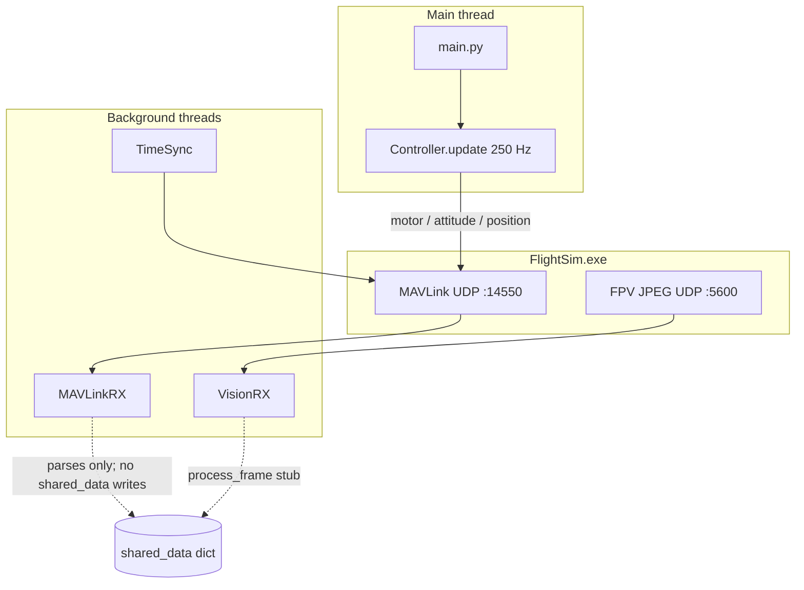

# Main Branch Documentation

Living reference for what is **merged on `main`** today. Update this file when features land on `main` — not when they exist only on feature branches or locally.

| Field | Value |
|-------|-------|
| **Last updated** | 2026-06-22 |
| **Main commit** | `a7dea83` — *documentation update; added new sim command* |
| **Maintainer note** | Add a one-line entry to [Changelog](#changelog) per substantive merge to `main`. |

---

## Table of contents

1. [Purpose](#1-purpose)
2. [Quickstart](#2-quickstart)
3. [Repository layout](#3-repository-layout)
4. [System architecture](#4-system-architecture)
5. [Module reference](#5-module-reference)
6. [External interfaces](#6-external-interfaces)
7. [Control modes](#7-control-modes)
8. [Makefile targets](#8-makefile-targets)
9. [Dependencies & tooling](#9-dependencies--tooling)
10. [Current capabilities & gaps](#10-current-capabilities--gaps)
11. [How to update this doc](#11-how-to-update-this-doc)
12. [Changelog](#changelog)

---

## 1. Purpose

This repo is the **ANDURIL** team's autonomous pilot for the [AI Grand Prix](https://www.theaigrandprix.com/) competition. The `main` branch currently holds the **official AI-GP Python client scaffold**: MAVLink + FPV vision plumbing, a minimal control loop, and project tooling. Autonomous race logic (gate detection, navigation, state estimation, telemetry) is **not yet on `main`** — it lives on feature branches (e.g. `spec.md`, `drone/trung`) and will be documented here after merge.

For competition context (timeline, hardware, rules), see [docs/Instructions.md](Instructions.md).

---

## 2. Quickstart

**Prerequisites:** [uv](https://docs.astral.sh/uv/), Python ≥ 3.13. On Windows, install `make` via `choco install make`.

```bash
make          # uv sync — install dependencies
make check    # ruff lint + format
make sim      # connect to FlightSim.exe and run control loop
```

**Before `make sim`:**

1. Launch **FlightSim.exe** from your AI-GP Simulator install.
2. Log in and start a qualifier / flight session (not just the main menu).
3. Ensure nothing else is bound to UDP **14550** (MAVLink) or **5600** (vision).

The client waits for a MAVLink heartbeat, arms the drone, then enters a 250 Hz control loop until interrupted.

---

## 3. Repository layout

Files tracked on `main` as of the snapshot above:

```
docs/
  Instructions.md       # Competition overview, sim setup, timeline
  main-documentation.md # This file
simulator/
  __init__.py
  controller.py         # Control loop + arm/disarm/reset
  mavlink_rx.py         # MAVLink receive thread
  setup.py              # Component wiring
  timesync.py           # TIMESYNC request loop
  vision_rx.py          # FPV JPEG UDP receiver
main.py                 # Entry point
Makefile                # install, check, sim
pyproject.toml          # Dependencies (uv)
uv.lock
README.md
AGENTS.md / CLAUDE.md   # Agent / contributor rules
.agents/skills/deslop/  # Pre-commit cleanup skill
```

**Not on `main` yet** (examples from active branches — update this list after merges):

| Area | Status on `main` |
|------|------------------|
| Autonomous pilot (`pilot.py`, race GO, takeoff) | Not merged |
| Gate vision / PnP | Not merged |
| Local tracker / IMU fusion | Not merged |
| Racing planner / navigation | Not merged |
| Flight telemetry CSV + validators | Not merged |
| `tests/` suite | Not merged |
| `SPEC.md` flight implementation spec | Not merged |
| `rl/` reinforcement-learning experiments | Not merged |

---

## 4. System architecture



### Startup sequence (`main.py`)

1. Create empty `shared_data` dict.
2. `setup_components()` — UDP MAVLink listen, wait for heartbeat, start RX threads.
3. `controller.arm()` — `MAV_CMD_COMPONENT_ARM_DISARM`.
4. Infinite `controller.update()` loop (250 Hz).
5. On exit (currently unreachable without kill): join threads.

There is **no** preflight gate-map wait, race-GO latch, or graceful shutdown handler on `main` yet.

---

## 5. Module reference

### `main.py`

Minimal sample client from the AI-GP template. Connects, arms, runs the control loop. No CLI arguments.

### `simulator/setup.py`

Wires four components and returns them in a dict:

| Key | Component |
|-----|-----------|
| `sim_conn` | `pymavlink` UDP connection (`udpin:127.0.0.1:14550`) |
| `mavlink_rx` | `MAVLinkRX` background thread |
| `ts_loop` | `TimeSync` background thread |
| `vision_rx` | `VisionRX` background thread |
| `controller` | `Controller` main-loop driver |

### `simulator/mavlink_rx.py`

Receives and **parses** MAVLink messages in a dedicated thread. Handlers unpack fields locally; **nothing is written to `shared_data` yet** — this is scaffolding for future state sharing.

| Message | Handler | Notes |
|---------|---------|-------|
| `HEARTBEAT` | `on_heartbeat` | Reads armed flag (unused) |
| `TIMESYNC` | `on_timesync` | Request/response times (unused) |
| `ATTITUDE` | `on_attitude` | Roll/pitch/yaw + rates |
| `LOCAL_POSITION_NED` | `on_local_position_ned` | Position + velocity |
| `ODOMETRY` | `on_odometry` | Pose + quaternion + velocity |
| `HIGHRES_IMU` | `on_highres_imu` | Accel + gyro |
| `ENCAPSULATED_DATA` type 1 | `on_race_status` | Race timing, active gate index |
| `ENCAPSULATED_DATA` type 2 + chunks | `on_track_data` | Full gate map (NED poses) |
| `COLLISION` | `on_collision` | Gate (1001) / environment (1002) |
| `DATA_TRANSMISSION_HANDSHAKE` | chunk assembly | Reassembles multi-packet track data |
| `ACTUATOR_OUTPUT_STATUS` | `on_actuator_output_status` | Motor outputs |

Race status binary layout (`struct.unpack_from("<BQqqIq", …)`):

| Field | Meaning |
|-------|---------|
| `sim_boot_time_ms` | Sim uptime |
| `race_start_boot_time_ms` | Scheduled GO; `< 0` if not started |
| `race_finish_time_ns` | Finish time; `< 0` if ongoing |
| `active_gate_index` | Sim's current target gate |
| `last_gate_race_time` | Seconds when last gate passed |

Track gate entry layout (`<Hfffffffff` per gate): `gate_id`, NED position (x,y,z), NED quaternion (w,x,y,z), `width`, `height`.

### `simulator/vision_rx.py`

Listens on `0.0.0.0:5600` for chunked JPEG frames.

**Packet header** (`<IHHIIQ`): `frame_id`, `chunk_id`, `total_chunks`, `jpeg_size`, `payload_size`, `sim_time_ns`.

Reassembles chunks, decodes with OpenCV, calls `process_frame()` — which is currently **`pass`** (no perception logic).

### `simulator/timesync.py`

Sends `TIMESYNC` requests at **10 Hz** (`TIMESYNC_REQUEST_HZ`). Does not store results in `shared_data`.

### `simulator/controller.py`

Runs at **250 Hz** (`CONTROL_HZ`). Default path calls `update_motor_control()` with hard-coded motor RPMs. Alternative modes exist but are commented out:

| Function | MAVLink command | Default constants |
|----------|-----------------|-------------------|
| `update_motor_control` | `SET_ACTUATOR_CONTROL_TARGET` | FL=0, FR=1, BL=0, BR=0 |
| `update_attitude_flight_control` | `SET_ATTITUDE_TARGET` (body rates) | pitch −0.3 rad/s, thrust 0.6 |
| `update_position_flight_control` | `SET_POSITION_TARGET_LOCAL_NED` | 2 m/s forward vx |

Also exposes `arm()`, `send_sim_reset_command()` (`MAVLINK_CMD_SIM_RESET = 31000`).

---

## 6. External interfaces

### MAVLink (inbound UDP `127.0.0.1:14550`)

Client acts as GCS: listens on `udpin`, waits for heartbeat, can arm and send control targets.

### FPV vision (inbound UDP `0.0.0.0:5600`)

Chunked JPEG at 640×360 (per AGP spec). Decoder ready; no downstream processing on `main`.

### `shared_data`

Created in `main.py` and passed to all components. **Currently unused for cross-thread state** — future merges should populate keys here (see flight spec on feature branches for the target schema).

---

## 7. Control modes

`Controller.update()` selects one control path per tick. On `main`, only **motor control** is active. To experiment locally, uncomment `update_attitude_flight_control` or `update_position_flight_control` in `controller.py`.

**Note:** Competition flight software on feature branches uses **50 Hz** attitude body-rate control with thrust-based altitude — different from this 250 Hz scaffold.

---

## 8. Makefile targets

| Target | Command | Purpose |
|--------|---------|---------|
| `make` / `make install` | `uv sync` | Install dependencies |
| `make check` | `ruff check --fix` + `ruff format` | Lint and format |
| `make sim` | `uv run main.py` | Run pilot against live sim |

No `test`, `validate-log`, or diagnostic targets on `main` yet.

---

## 9. Dependencies & tooling

**Runtime** (`pyproject.toml`): `pymavlink`, `opencv-python`, `numpy`, `matplotlib`, `keyboard`.

**Dev:** `ruff`, `lefthook`.

**Conventions** (`AGENTS.md`):

- Use **uv** for all Python (`uv run …`).
- Simulator logic lives in `simulator/`; `main.py` stays minimal.
- Makefile is the script entry point, not `pyproject.toml` scripts.
- Run deslop skill before commits.

---

## 10. Current capabilities & gaps

### Working on `main`

- UDP MAVLink connect + heartbeat wait
- Background receive for core sim messages (parse-only)
- Multi-packet track gate reassembly (parse-only)
- FPV JPEG receive + decode
- TIMESYNC request loop
- Arm + motor / attitude / position control stubs
- Sim reset command helper
- `uv` + `make` dev workflow

### Not implemented on `main`

- Writing telemetry into `shared_data`
- Race GO detection and takeoff sequencing
- Gate detection, PnP, or any vision-based steering
- Map-based navigation or gate pass logic
- Collision recovery
- Automated tests
- Flight / tracking log validation
- Preflight checks (track loaded, ports free)
- Graceful `KeyboardInterrupt` shutdown in `main.py`

### Suggested merge order (update as reality diverges)

When documenting future merges, prefer this structure:

1. **Connectivity** — `shared_data` population, preflight, port checks
2. **Perception** — `vision_processing`, gate detection
3. **Estimation** — `LocalTracker`, IMU propagation
4. **Pilot** — race phases, `flight_control`, collision recovery
5. **Observability** — telemetry CSV, validators, smoke scripts
6. **Tests** — `tests/` + CI

---

## 11. How to update this doc

After merging to `main`:

1. Check out `main` and note the merge commit hash.
2. Update **Last updated** and **Main commit** at the top.
3. Refresh [Repository layout](#3-repository-layout) and [Current capabilities & gaps](#10-current-capabilities--gaps).
4. Add or extend [Module reference](#5-module-reference) sections for new files.
5. Add a [Changelog](#changelog) row.

Keep feature-branch detail in branch-specific docs (e.g. `SPEC.md`) until it ships on `main`.

---

## Changelog

| Date | Commit / PR | Summary |
|------|-------------|---------|
| 2026-06-22 | — | Initial `main-documentation.md` — documents `main` scaffold through `a7dea83` |
| 2026-06-02 | `a7dea83` | README + `make sim` on `main` |
| 2026-05-xx | `1645b28` | Reorganized codebase; simulator package extracted |
| 2026-05-xx | `0ff653c` | Repo init from AI-GP template |

*Add rows above this line when `main` gains new capabilities.*
